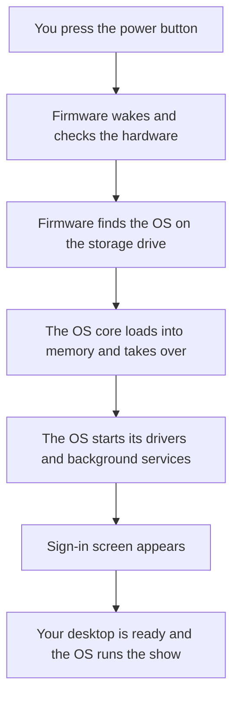
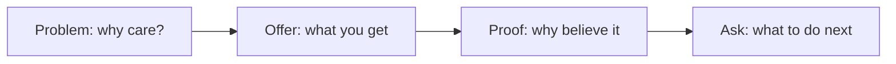

# Chapter 4: What Makes Your Device Run: Operating Systems and Utilities

Darnell Brooks manages Saguaro Hall, a community event venue in downtown Phoenix. On the morning of a 200-guest quinceañera, his front-desk computer decides it is time to talk. An update notice fills the screen. The booking calendar sits behind it, a client is on the phone, and Darnell asks the question half the working world has asked: "Can I just make these go away forever?" It sounds like a small preference. It is a decision about the most important software he owns, and by the end of this chapter you will be able to give him a better answer than "click Later."

Chapter 1 sorted all software into two layers and promised each layer its own chapter. Chapter 3 covered the top layer, the applications you choose. This chapter goes underneath, to the **operating system** (OS), the program that starts the machine, manages its hardware, and launches everything else. You never open the OS the way you open Word. Yet it decides which apps you can run, how many run at once, and how long your machine stays safe. Lately it also decides what an AI assistant built into the computer is allowed to see. Every major in this room inherits those decisions the moment they touch a work machine.

Here is the route. First you will watch the OS do its three jobs: wake the machine, juggle its resources, and serve your apps. Then you will tour the platforms those jobs run on, from Windows and macOS to the phone in your pocket and the new desktops that live in the cloud. Third, you will meet the OS's quiet residents: the utilities, drivers, and updates that keep it healthy, and the AI assistants that now watch the screen. Finally, the Skills Lab thread moves to PowerPoint. Saguaro Hall's pitch outline becomes a themed, presenter-ready slide deck, and Chapter 3's styles lesson pays off in a way that may surprise you.

## Module Overview 🧭

* **Estimated time:** 4-5 hours
* **Prerequisites:** None (chapters teach from zero), builds on Chapters 1-3 (software layers, verification habit, Word styles)
* **Deliverables:** Skills Lab 4A deliverable, Quick Checks

## Learning Objectives 🎯

By the end of this chapter, you will be able to:

* **4.1 (Understand):** Explain how the operating system starts the machine, manages its resources, and runs your applications (Section 4.1)
* **4.2 (Analyze):** Compare desktop, mobile, virtual, and cloud platforms and select the one that fits a task and its apps (Section 4.2)
* **4.3 (Apply):** Produce a themed, structured pitch presentation in PowerPoint from a provided Word outline (Section 4.4)

### This chapter aligns with the following Course Learning Outcomes

* **CLO II (Analyze):** Classify system and application software and match each type to the tasks it serves
* **CLO XIII (Apply):** Produce documents, spreadsheets, databases, and presentations with industry-standard productivity software

---

## 4.1 The Invisible Manager: Boot, Juggle, Serve

Press the power button on any computer and, for a few seconds, nothing you bought it for exists yet. No apps, no files, no desktop. Something has to build that world before you can use it, and that something is the operating system. This section follows its three jobs in order: it wakes the machine, it juggles the machine's resources, and it serves every app you run. Learn the three jobs and a whole family of everyday mysteries (why restarting fixes things, why "too many tabs" slows a laptop, why a computer takes time to start) stop being mysteries.

Clear one misconception before the tour starts. People say "I have a Windows" the way they say "I have a Toyota," as if the OS were the machine. It is not. The OS is software installed on the machine, and the two are separable. The same laptop that runs Windows today could be wiped and boot Linux tomorrow, and many phones outlive two or three major versions of their OS. Keep the layers separate in your head (hardware below, OS in the middle, your apps on top) and the rest of Part II will keep snapping into place.

### Waking the Machine

The OS lives on your storage drive, and a program on a drive is just data. Something already running has to go get it. That something is **firmware**: a small program stored permanently on a chip on the computer's main board, which runs the instant power arrives. Firmware does not know about your files or apps. It knows how to check that the hardware answers, find the OS on the drive, and hand over control.

That handoff sequence is called the **boot** process, and it runs the same way on a laptop, a phone, and a server. The relay has six steps:

1. Power reaches the firmware chip, and the firmware wakes.
2. The firmware checks that the hardware answers.
3. The firmware finds the OS on the storage drive and loads its core into memory.
4. The OS takes over and starts its drivers and background services.
5. The sign-in screen appears.
6. You sign in, and the OS builds your desktop.

The diagram below shows the same six-step relay as a picture.



Two practical facts fall out of the boot story. First, a computer that powers on but never reaches sign-in is failing somewhere in that relay, which narrows the search the way Chapter 1's six questions do. Second, "turn it off and on again" is not folklore. A restart re-runs the relay from a clean start, which is why it cures so much. The next subsection explains what the restart is cleaning up.

### The Juggler Behind Every Click

Once running, the OS becomes a full-time resource manager. Your machine has one pool of processing power, one pool of memory, one storage drive, and one network connection. Every open app wants a share of each, and the OS referees all of it, billions of times per second.

The headline trick is **multitasking**: the OS switches the processor between running programs so fast that everything appears to run at once. While you read this sentence, your machine is also checking mail, syncing files, listening for notifications, and drawing the screen. None of that is simultaneous in the way it feels. It is one juggler keeping thirty plates spinning by touching each one thousands of times a second.

Memory is the resource students feel most. Every open app and browser tab claims a slice of the machine's fast working memory (Chapter 5 opens the case and names the parts). When that memory runs low, the OS starts parking the least-used items on the storage drive, which is far slower, and the whole machine turns sluggish. That is why a two-year-old laptop with forty browser tabs open "feels old" and feels young again after a restart: the restart returns every borrowed slice of memory. Age was never the problem. Occupancy was.

This is also the honest mechanism behind the restart-first habit. Over days of use, memory fills with leftovers, programs accumulate small errors, and pending updates wait for a reboot to finish installing. A restart clears the leftovers, resets the errors, and lets the updates land. When something misbehaves at the software layer, restart first, then investigate.

### Every App's Landlord

The third job is the one Chapter 3's applications quietly depend on: the OS runs your apps, and it stands between them and everything they touch. When Word saves a file, it asks the OS to write to the drive. When a browser fetches a page, it asks the OS for the network. When the Desert Bloom register app prints a receipt, it asks the OS to talk to the printer. Apps never touch hardware directly. They file requests with the landlord, and the landlord keeps tenants from wrecking the building or reading each other's mail.

Even the double-click that opens an app is a small relay of its own:

1. You open the app, and the OS finds its program file on storage.
2. The OS loads the program into memory and adds it to the multitasking rotation.
3. The OS hands the app a window to draw in.
4. From then on, every save, print, and page the app needs is a request the OS grants or denies.

Hold onto step four, because it is the enforcement point for everything else in this chapter. Accounts work because the landlord checks who is asking. The app permissions in Section 4.3 work because the landlord can say no.

You meet this landlord through its **graphical user interface** (GUI): the windows, icons, menus, and pointers that turned computers from expert tools into everyone's tools. Touchscreens replaced the pointer with a finger, and voice assistants added an interface you can talk to. Underneath every one of them, the same three jobs run unchanged. (A text-only command line also still exists under every major OS. Professionals in IT fields use it daily, and you will glimpse the idea again when Chapter 12 shows you code driving an app.)

### An Interface for Every Body

The standard GUI quietly assumes a user who sees the screen, hears the speaker, and steers a pointer precisely. Plenty of people, permanently or temporarily, do not fit one of those assumptions, so every major OS ships a second set of interfaces alongside the first:

* A **screen reader** (Narrator on Windows, VoiceOver on Apple systems, TalkBack on Android) speaks the interface aloud, so the machine can be run entirely by ear.
* Live captions turn any audio the machine plays, from a lecture video to a call, into on-screen text.
* Voice control runs the whole system by spoken command, and magnifiers, zoom, and high-contrast modes reshape the screen itself.

Notice where these live: in the OS, not in individual apps. That placement is the point of this whole section. Because every app asks the landlord to draw its windows, an accessibility feature built into the landlord works across every app at once, including the ones written by developers who never thought about it. These features ship with every machine you will ever buy, waiting in Settings, and knowing they exist is a working skill. The classmate with a broken arm, the customer who reads captions, and the colleague using a screen reader are all running the same OS you are, through a different door.

### One Machine, Many People

The landlord also keeps a guest register. A **user account** is the OS's record of one person: their files, settings, and permissions, unlocked by their sign-in. Accounts are why a shared machine can serve a whole household or a whole front desk without anyone reading anyone else's files. They are also why step five of the boot relay exists at all. The OS will not build a desktop until it knows whose desktop to build.

Accounts come in ranks, and the ranks are a safety feature. An **administrator account** can install software, change system settings, and create other accounts. A standard account can use the machine but not rewire it. The professional pattern puts daily work in standard accounts and saves the administrator sign-in for deliberate changes, because malware that lands in a standard account inherits that account's limits.

Run the pattern on Saguaro Hall's front desk. Two part-time staff check guests in, pull up bookings, and print contracts. None of that needs the power to install software, so their accounts should be standard ones. Darnell keeps the one administrator account for himself, for update approvals and new software. Now a bad click by a Saturday hire cannot install anything. The six-questions habit gets a head start too: when something changed on the machine, the list of accounts that could have changed it has one name on it. Chapter 8 builds a whole defense on this idea of least necessary power.

### Reading the Gauges

You can watch the juggler work. Windows ships **Task Manager** (press ++ctrl+shift+esc++), and macOS ships **Activity Monitor** (in Applications > Utilities). Both show every running program, including the background ones you never launched, and what each is costing in processor time and memory. When a machine slows down, professionals look at these gauges before blaming the machine's age. The drill has three steps: open the gauge, sort by memory or processor, and read the top of the list. The evidence usually names one greedy app, and closing it beats buying a new laptop.

The gauges are also where you end a standoff with a frozen app. When one program stops answering while the machine otherwise works, select it in Task Manager and choose End task, or press ++option+cmd+esc++ on a Mac and Force Quit it. Force-quitting discards that app's unsaved work, so it is the move of last resort for one stuck tenant, and a restart remains the move when the whole building misbehaves. Match the size of the fix to the size of the failure.

One more everyday decision belongs here: sleep, shut down, or restart? Sleep pauses the machine and holds your open work in memory, which is why modern laptops close and reopen in a second, and it is the right default between work sessions. Shutting down clears memory and stops everything, which suits a machine going in a bag for a week. Restarting is the repair move: it clears the leftovers and lets waiting updates finish. A practical rhythm: sleep daily, restart when the machine asks or misbehaves, and never brag about an uptime measured in months.

Each of the OS's jobs also has a signature failure, and matching symptom to job is the software-layer version of Chapter 1's six questions:

| OS job | When it works | What failure looks like |
| ------ | ------------- | ----------------------- |
| Booting | Desktop ready in under a minute | Power comes on, but sign-in never arrives |
| Managing resources | Dozens of programs, no drama | Sluggishness, fan noise, frozen apps |
| Running apps | Apps open, save, print, connect | One app cannot reach its files or the printer |
| Keeping accounts | Each person sees their own desktop | Settings changed that nobody admits changing |

### Try It Yourself 4.1: Count the Plates 🛠️

**Predict:** Your machine is running programs you never opened. Write down a number: how many programs and background helpers do you believe are running on your computer right now? Then write which visible app you believe is using the most memory.

**Run:** Open Task Manager (++ctrl+shift+esc++) or Activity Monitor (Applications > Utilities), sort by memory, and check both guesses. Count everything listed, not just the apps you recognize.

**Explain:** In 1-2 sentences, explain the gap between your prediction and the count. Why does the OS run so much you never asked for, and what does that tell you about where your memory goes?

### Try It Yourself 4.2: Run the Machine by Ear 🛠️

**Predict:** You are going to turn on live captions, play any video, and judge the result. Commit a rating in writing first: will the captions be usable for a lecture (yes or no), and what kind of word do you expect them to miss most?

**Run:** Turn on the system caption feature (Windows: ++win+ctrl+l++ or Settings > Accessibility > Captions. Mac: System Settings > Accessibility > Live Captions. Phones carry the same feature under Accessibility). Play two minutes of any video with the sound low and read along. Turn it off when done.

**Explain:** In 1-2 sentences, compare the result to your prediction and name one situation in your own week where this OS-level feature (working in every app at once) would earn its place.

### Quick Check 4.1 ✅

1. Put these boot events in order from memory: the OS core loads into memory, firmware checks the hardware, the sign-in screen appears, drivers and services start, power reaches the firmware chip.
2. A classmate's laptop crawls every Friday afternoon but runs fine Monday morning after the weekend shutdown. Using this section's resource story, explain the pattern in two sentences.
3. Saguaro Hall hires two part-time staff for the front desk. Explain why they should get standard accounts while only Darnell's account can install software, and name the OS job that makes the separation possible.

---

## 4.2 Every Screen Has a Boss: Platforms From Desk to Cloud

Chapter 1 introduced operating systems by name. This section turns the name list into a decision. A **platform** is an operating system plus the hardware it runs on, taken together as the base that apps are built for. Developers build an app for a platform, not for "computers," and that single fact drives every choice this section teaches. The tour runs desk to pocket to cloud, and it ends with a checklist you can defend.

### Four Systems for the Desk

**Windows**, now at version 11, is Microsoft's OS and the default of office life. It runs on hardware from dozens of manufacturers at every price, which gives it the widest reach of any desktop platform and the largest catalog of business software. School labs, front desks, and many of the machines behind cash registers run Windows. When a job posting says "proficient with computers," Windows is usually the unstated assumption.

**macOS** runs only on Apple's own computers, which is the trade at the heart of the platform: less hardware choice, tighter fit between the parts. Apple ships a new version every fall and names them by year now (the 2025 release is macOS Tahoe, version 26). In design, video, and audio fields the platform carries a deserved reputation, and it earns general office work just as well. One myth needs retiring on the way past: Macs get malware too. Fewer targets historically meant fewer attacks, not immunity, and Chapter 8 treats both platforms as targets.

**Linux** is the free, open-source OS that almost nobody's laptop runs and almost everything else does. Most of the Internet's servers, including the ones behind your coffee order in Chapter 1, run Linux. So do supercomputers, most smart TVs, and (under a layer you never see) every Android phone. On the desktop it remains a small, devoted world. In server rooms it is the world.

**ChromeOS** takes Chapter 3's web-app idea to its logical end: a laptop that is mostly a browser, cheap to buy and easy to manage, which is why schools deploy Chromebooks by the cart. Its limit is the same as its design: when a task needs an installed desktop app, a browser-first machine cannot oblige.

One more family belongs on the map because you met its members in Chapter 1. The register at Desert Bloom, a hospital infusion pump, a car's dashboard, and the venue's smart thermostat all run stripped-down systems built into the device, doing one job for the device's whole life. Nobody chooses these systems and nobody browses on them, but they boot, manage resources, and run their one app exactly like their big siblings. When this book says every computer has an OS, it means every computer.

| Platform | Runs on | Its strength | Where you will meet it |
| -------- | ------- | ------------ | ---------------------- |
| Windows 11 | Hardware from many makers | Reach: the widest app and hardware catalog | Offices, labs, front desks, gaming |
| macOS | Apple computers only | Fit and finish, strong in creative fields | Studios, design shops, many startups |
| Linux | Almost anything | Free, open source, runs the Internet's servers | Server rooms, and inside Android |
| ChromeOS | Chromebooks | Cheap, simple, managed by the cart | Classrooms, kiosks |

### Two Systems in Your Pocket

Phones repeat the same split with new names. **iOS** (version 26, on the same year-based numbering Apple now uses across its systems) runs only on iPhones, with apps arriving through one curated store. **Android** (version 16) runs on phones from many makers at every price, with more freedom about where apps come from. One practical difference matters for Section 4.3: when Apple ships an update, nearly every supported iPhone can install it that day. Android updates flow through each phone's manufacturer, so how fast you get them, and for how many years, depends on the maker you chose. Both platforms now ship an AI assistant as a built-in resident, and the next section examines what those residents can see.

| | iOS | Android |
| --- | --- | ------- |
| Hardware | iPhones only | Many makers, every price |
| Apps come from | One curated store | Google's store, plus other doors the owner can open |
| Updates | From Apple, to nearly all supported phones at once | Through each maker, on that maker's schedule |
| Built-in assistant | Siri, with Apple's on-device AI features | Gemini |

Neither column wins. The trade is the same one the desktop table showed: one platform trades choice for uniformity, the other trades uniformity for choice. What the table hands you is the questions to ask about any phone in front of you: who ships its updates, for how long, and through how many hands?

### One Machine, Many Systems

The OS boots first and runs the show, but a running OS can host another one. **Virtualization** is software pretending to be hardware. A program carves out a slice of your machine and presents it as a complete pretend computer, called a **virtual machine**, with a second OS booted inside it, windowed like any app. A designer runs one Windows-only estimating tool on a Mac this way. An IT student breaks a Linux system on purpose inside a virtual machine and deletes the wreckage afterward. A careful business tests this month's update inside a virtual machine before its working computers get it. And the cloud from Chapter 1 is virtualization at industrial scale. One physical server in a data center hosts dozens of virtual machines, each rented to a different customer who believes they have a whole computer. They do. It is just made of software.

### The Desktop Moves Online

Push that idea one step further and the machine on your desk stops mattering. A **cloud desktop** is a complete OS, apps and files included, that runs on a server in a data center and streams to whatever screen you sign in from. Microsoft's Windows 365 is the anchor example: a business hands an employee a "Cloud PC" that follows them from an office desktop to a home laptop to a tablet, always the same desktop, mid-sentence. Businesses like what that does to two old problems: a lost laptop loses no files (nothing was stored on it), and a new hire's machine takes minutes to issue instead of days. The costs are a subscription that never ends and total dependence on the connection. When the Internet drops, the entire computer is on the other side of the outage.

| | A PC you own | A cloud desktop |
| --- | ------------ | --------------- |
| Paying | Once, up front | Monthly, forever |
| Updates and repairs | Your job (Section 4.3) | The provider's job |
| A stolen or dead device | Files gone unless backed up | Sign in from any other screen |
| Internet outage | Keep working offline | No computer until it returns |
| Best fit | Personal machines, offline work | Businesses managing many seats |

### The App Decides: A Platform Checklist

Now the decision. People pick platforms by brand loyalty, by price, or by what the salesperson pushed. Professionals run Chapter 3's logic one level down: task first, software second, and now platform third. The checklist:

1. **List the apps the work cannot happen without.** Not the nice-to-haves. The cannot-do-the-job-withouts.
2. **Check each app's official requirements page.** Which platforms does it run on, and which OS versions? (Chapter 2's habit applies: the developer's own page, not a forum's memory of it.)
3. **Only then weigh the rest.** Price, hardware you already own, what you and your coworkers already know, and how long the maker supports its systems.

That third step hides a question buyers skip. Every device you buy comes with an unwritten expiration date: the day its maker stops supplying OS updates. Phone and computer makers publish support policies, and the spans differ by years between brands and models. Two phones at the same price are not the same price if one gets patches for three more years and the other for seven. Section 4.3 shows why that date has teeth. For now, put "how long will this be supported?" on the list of questions you ask before money moves.

The checklist also explains why platform choices harden over time. Your documents travel well (a `.docx` opens anywhere, and PDF was built for exactly this). The rest travels badly: platform-locked apps must be repurchased or replaced, settings and shortcuts reset to zero, and years of muscle memory argue with a new set of menus. That switching cost is why businesses standardize on one platform and stay for a decade, and why web apps keep gaining ground. A tool that lives in the browser, like the venue's booking system or this course's Airtable, makes the platform argument matter less every year.

Now run the checklist on Saguaro Hall's front desk. The cannot-do-withouts come first. The booking system is a web app, so any platform qualifies. Contracts and pitches need Word and PowerPoint, preferably installed, so ChromeOS drops out. The card-reader software for deposits ships for Windows only, and that ends the contest. The front desk is a Windows machine, not because Windows is "best," but because one required app closed every other door. Most platform decisions in working life end exactly this way, settled by the software, not the sticker.

Run it once more, closer to home. A student is laptop shopping for a program whose courses require a proctored-exam browser, and the college's requirements page lists Windows and macOS support with no Chromebook option. Step one just wrote the short list. Step two is a two-minute read of that page. Step three (price, the campus lab's platform, what their study group runs) picks between the two survivors. Ten minutes of checklist beats four years of workarounds, and the same ten minutes will run again someday for a clinic's charting system or a shop's design suite.

!!! tip "Tech in Your Field"
    Platform decisions are made for you in most workplaces, and knowing why helps you work with them. Nursing and health sciences students will chart on locked-down Windows machines, chosen because the hospital's records system certifies against exactly one configuration. The infusion pumps and monitors around them run sealed systems nobody is allowed to touch. Business and entrepreneurship students will meet iPads running point-of-sale apps at the counter and a cloud desktop in the back office, chosen so a stolen tablet loses nothing. Visual and performing arts students will inherit macOS studios where the industry's tools grew up, then hand files to Windows-based clients, which makes Chapter 1's PDF habit a survival skill. Public safety and law students will file reports on rugged Android devices in the field and locked-down desktops at the station. Different rooms, same rule: the required apps chose the platform, and the role changed without disappearing.

### Try It Yourself 4.3: Name Your Own Boss 🛠️

**Predict:** Write down, without checking, the exact OS name and version number of the computer or phone you use most. (An answer like "Windows" does not count. Commit to a version.)

**Run:** Check. On Windows: Settings > System > About. On a Mac: Apple menu > About This Mac. On a phone: Settings > General > About (iOS) or Settings > About phone (Android).

**Explain:** In 1-2 sentences, state whether your version is current and how you would find out when it stops receiving updates. Section 4.3 explains why that date belongs on your calendar.

### Try It Yourself 4.4: Let the App Decide 🛠️

**Predict:** Pick one app your major or job depends on (an editing suite, a charting app, a stats package, a game engine). Commit a yes or no for each: does it run on Windows, macOS, ChromeOS, iOS, Android?

**Run:** Find the app's official system requirements page (search the app name plus "system requirements," then pick the developer's own site) and check your five answers.

**Explain:** In 1-2 sentences, state which platforms your app just eliminated and what that would mean if you were buying a machine for that work tomorrow.

### Quick Check 4.2 ✅

1. A café owner wants one cheap laptop for the counter: browser-based register, browser-based schedule, nothing installed. A friend insists "Windows, because everything runs on Windows." Using the checklist, make the case that a Chromebook qualifies, and name the one future change that would disqualify it.
2. Explain the difference between a virtual machine and a cloud desktop in one sentence each: where does each one run, and what does the machine in front of you contribute?
3. Your phone and your laptop both "have an OS." Name one way the phone platforms differ from the desktop platforms in how updates reach you, and why a buyer might care.

---

## 4.3 The Quiet Residents: Utilities, Drivers, and Updates

An operating system never works alone. Around it lives a small permanent staff. Housekeeping programs maintain the machine. Translators teach it new hardware. A patch crew repairs it while it runs. Newest on the roster is an AI assistant with a standing invitation to watch the screen. This section introduces each resident and ends at the question this chapter's opening put on the table: what should the newest resident be allowed to see?

### The Housekeeping Crew

Chapter 1 defined a **utility** as a housekeeping program, and the modern OS ships a full crew of them. Both Windows and macOS include a backup utility (File History and Time Machine, which Chapter 6 puts to work). Both include storage cleanup tools that find the gigabytes of forgotten downloads. Both run a security utility that watches for malware full time: Windows Security comes armed and enabled out of the box, and Apple's checks run quietly in the background.

That built-in crew changes a buying decision students face constantly. Ads for "PC cleaner" and "phone booster" apps promise to speed up your machine for a fee, and their sales pitch is a countdown of alarming red numbers. Chapter 3's advice (check what you already have first) applies with force: the OS already ships the honest version of almost everything those apps sell.

!!! warning
    Scare-style "cleaner" ads are a common front for the malware they claim to fight. A pop-up that counts your "437 critical errors" is not a diagnosis. It is bait, and Chapter 8 shows the hook. When a machine needs housekeeping, start in Settings, with the utilities that came with the OS.

### The Translators

A **device driver**, the second small program family from Chapter 1, is the OS's translator for one specific piece of hardware. Your printer, webcam, mouse, and graphics chip each speak their own dialect, and each needs its driver. What has changed since your parents fought with driver CDs: the OS now fetches most drivers itself, automatically, through its update system. You notice drivers today only at the edges, when brand-new hardware needs a download from the maker's site, or when a botched driver update makes a printer vanish. When one device misbehaves while everything else works, the translator is the suspect, and "reinstall the driver" is the software layer's version of Chapter 1's six-questions habit.

Here is how that plays out at the venue. The Tuesday after an update, Saguaro Hall's badge printer stops responding. Wi-Fi works, the booking system works, every other device answers. One device down while the rest of the system hums is the driver's signature. So the fix starts there: unplug and replug (which prompts the OS to reload the driver), then reinstall the driver from Settings or the maker's site. Total time, minutes. The alternative in the wild is an hour of restarting everything in sight, which is what troubleshooting looks like without a model of who translates for whom.

### The Update Habit

An update is the OS repairing itself while it runs, and one word covers several different deliveries:

| What arrives | What it does | How often |
| ------------ | ------------ | --------- |
| Security patch | Closes a hole attackers could use | Monthly or faster, and unannounced when urgent |
| Bug fix | Repairs a feature that misbehaves | Bundled with regular updates |
| Driver update | Refreshes a hardware translator | As the hardware makers ship them |
| Feature update | Adds or changes what the OS can do | A few times a year, or one big yearly release |

The row that carries the stakes is the first one. A **patch** is a fix for a security hole someone found, and the mechanism that makes patches urgent is not obvious. The day a patch ships, the hole it fixes becomes public knowledge. Attackers read patch notes too, and they immediately aim at the one group the patch cannot protect: machines that have not installed it yet. An unpatched computer is not merely "a little behind." It is advertising an open door that the rest of the world just closed.

Updates end eventually. Every OS version has an **end of support** date, after which the maker stops shipping patches for it. The software keeps running. The doors just stop getting fixed. The working world watched this play out in October 2025, when Windows 10, then still running on hundreds of millions of machines, reached its end of support. Microsoft offered a one-year bridge of security-only updates, and that bridge closes in October 2026, leaving every remaining Windows 10 machine to face new holes unrepaired, forever. Businesses that had treated "upgrade the front-desk PC" as a someday task spent that year doing it on a deadline instead.

Phones reach the same cliff sooner than most owners expect. A phone that still takes photos and still holds a charge can already be past its patch window, and it becomes the softest target its owner carries. That is why Section 4.2 told you to read support policies before buying: the support window, not the battery, decides a device's safe working life.

So here is the answer this chapter owes Darnell, in policy form:

* **Leave automatic updates on**, on the computer and the phone. The interruptions are the cost. The unpatched gap is the risk, and the risk compounds.
* **Restart when asked**, because many patches only finish installing during the reboot the machine has been requesting for a week.
* **Time it, do not skip it.** Both major systems let you set active hours or schedule the restart for tonight. "Later today" is a fine answer. "Never" is not one of the options, whatever the button seems to promise. (That is the real answer to the notice that ambushed Darnell in this chapter's opening: schedule it for closing time, and stop meeting it at 9 a.m.)
* **Know your end-of-support dates.** When the OS on a machine you rely on has one coming, the replacement plan starts then, not after.

The one legitimate exception proves the rule: businesses running critical systems sometimes hold a new update briefly and test it on one machine first, because a rare bad update can break a workflow. Notice what that exception is: a plan for installing updates carefully. It is never a plan for skipping them.

One authenticity rule guards the whole habit: real updates arrive through the OS's own updater, in Settings, and through the app stores. They do not arrive as browser pop-ups, email attachments, or a website's insistence that your "player is out of date." Attackers dress malware as updates precisely because this chapter trains people to say yes to updates. So the habit has two halves that never conflict: install updates promptly, and install them only from the system that is supposed to deliver them. A pop-up demanding an urgent update gets the Chapter 2 treatment: close it, open Settings yourself, and let the updater tell you the truth.

### Try It Yourself 4.5: Find Your Update Trail 🛠️

**Predict:** Commit to two answers in writing. When did your main computer or phone last install an update, within a week? And is a restart currently pending on it, yes or no?

**Run:** Check the record. On Windows: Settings > Windows Update > Update history. On a Mac: System Settings > General > Software Update. On a phone: Settings > General > Software Update (iOS) or Settings > System > Software updates (Android).

**Explain:** In 1-2 sentences, compare the record to your prediction and state what your update settings are currently promising (automatic, scheduled, or waiting on you). If a restart has been pending for days, you now know what it has been waiting to finish.

### The Assistant That Sees Your Screen

Now the newest resident. The AI assistants you met in Chapters 1-3 lived inside single apps or a browser tab. Operating systems now ship assistants at the system level: Copilot answers from the Windows taskbar, Apple's assistant reaches across iPhone and Mac apps, and Gemini rides inside Android. System-level position means system-level sight. Ask "summarize the document on my screen" and the assistant can only comply because the OS granted it a view of the screen.

The hardware from Chapter 1 returns here. On an **AI PC**, the NPU runs many of these features on the device itself, so a live caption or a summary can happen without your data leaving the machine. The most ambitious version is Microsoft's Recall, available on Copilot+ PCs and switched off until you opt in. It photographs your screen every few seconds and lets you search everything you have ever seen, processing the archive on the device. Apple takes a related line: handle requests on the device where possible, and route bigger jobs to servers Apple says are built so that no one, Apple included, can read your data. The engineering differs. The direction is shared: the assistant gets more sight, and the makers spend real effort arguing you can trust the sight.

You do not have to take the argument on faith, because the OS puts the decision where it belongs: with you. The same permission system that governs every app governs the assistant. It asks before it sees, features arrive off until you enable them, and Settings lists every grant you have made. Which leaves the human jobs from Chapter 1 squarely in play. Before enabling any feature that watches the screen or reads your files, ask two questions:

1. **What does this feature need to see to do this job?** A caption feature needs audio. A "search my past screens" feature needs your screens, all of them: the group chat, the bank statement, a patient record if your job shows you one.
2. **Where does that data go?** On-device processing and server processing are different promises. The setting's description tells you which one you are accepting, and now you know to read it.

Watch the two questions separate two features that sound alike. Live captions ask to hear the audio currently playing, process it on the device, and keep nothing. Modest sight, short memory: most people can say yes without a second thought. A screen-history search asks to see everything you will ever display and to keep it searchable. Even processed on the device, that archive now exists, which changes what a stolen laptop, a shared sign-in, or a court order can reach. Same vendor, same assistant, two different answers, and the difference came from asking, not from trusting or refusing the whole category.

There is no universally right answer, and that is the point. A student's laptop and a nurse's charting station should answer these questions differently, and employers increasingly answer them in writing (recall Chapter 3's rule about pasting confidential content into AI tools). What you owe yourself is an answer you chose. Chapter 8 widens this lens from the assistant on your screen to everyone else collecting your data, and the two questions come along.

### Try It Yourself 4.6: Audit the Grants 🛠️

**Predict:** Pick the three apps you use most on your phone. For each, commit a yes or no: does it currently have permission to use your microphone? Your location?

**Run:** Check. On iOS: Settings > Privacy & Security, then Microphone and Location Services. On Android: Settings > Security & privacy > Permission manager. While you are there, skim the full permission list for anything that surprises you.

**Explain:** In 1-2 sentences, name the most surprising grant you found and apply the two questions: does the app's job need it, and did you knowingly choose it? Revoke anything that fails both tests.

### Quick Check 4.3 ✅

1. A patch shipped yesterday. Rank these three machines by risk: one that installed it, one that has not yet, and one running a version past its end of support. Defend your top pick.
2. A pop-up on the venue's computer counts "312 critical errors" and offers a free scan. Using this section and Chapter 2's verification habit, write the two-step response you would give Darnell.
3. A friend enables an assistant feature that summarizes whatever is on screen, reasoning "it is built into the OS, so it must be private." Repair that reasoning in one sentence using the two questions.

---

## 4.4 From Outline to Stage: Slides That Support a Speaker

The Skills Lab thread now changes tools. You spent three chapters making documents that readers process alone, at their own speed. A presentation is the opposite instrument: a live audience, your voice carrying the content, and slides on a screen behind you. Darnell has five minutes at a Phoenix small-business showcase to pitch Saguaro Hall to the room, and his approved outline is in your data pack. This section teaches what makes slides work, and the fastest professional route from an outline to a deck.

### What a Slide Is For

A **pitch deck** is a short presentation built to sell an idea: a business, a project, a budget request. Every field pitches. Founders pitch investors, nurses pitch process changes to unit councils, artists pitch commissions, and students pitch senior projects. The form rewards one skill above all: knowing what a slide is for.

A slide is not a document. Your audience cannot read a paragraph and listen to you at the same time. Given a full screen of text, they will read it, stop listening, and finish annoyed that you read it to them. The professionals' split: the slide carries the signal (a claim, a number, a name, an image), and the speaker carries the story. PowerPoint builds this split into the file through **speaker notes**, a pane below each slide where your script lives. The audience never sees the notes pane. Presenter View puts it on your screen while the audience sees only the slide, which means the deck file holds both halves of the talk: theirs and yours.

That gives you a working test for every bullet you write. If you would say it as a sentence, it belongs in the notes. What survives on the slide is the shortest version the audience should remember:

```text
Bullet, before (a script pretending to be a slide):
* Our main hall seats two hundred guests and can be arranged
  in banquet, theater, or classroom layouts by our staff.

Bullet, after (a slide doing its job):
* 200 seats, four layouts, staff does the moving

Speaker notes: "The main hall seats two hundred. Banquet,
theater, classroom, open floor: our staff rearranges it for
you, same-day."
```

Notice what the notes did in that example. They are not a copy of the bullet, and they are not an essay. They are the spoken sentence, written the way a person talks, with the detail the slide dropped. The lab will ask you to write notes "in Darnell's voice," and this is the assignment. Read your slide, then write what Darnell would say while it is on screen, in two or three speakable sentences.

### The Shape of a Pitch

Before any slide gets made, a pitch needs a spine, and the working spine has four beats in a fixed order. First the problem: why should this room care? Then the offer: what is it, and what does the audience get? Then the proof: why believe you? Last the ask: what exactly should the audience do next? The order is the argument. Proof lands only after the audience knows what is being proven, and an ask lands only after the proof.



| Beat | The question it answers | In Saguaro Hall's outline |
| ---- | ----------------------- | ------------------------- |
| Problem | Why should this room care? | The Gap in the Middle |
| Offer | What is it, and what do I get? | The Space, What a Booking Includes |
| Proof | Why believe you? | Why Saguaro Hall Works, Local Partners, What Clients Say |
| Ask | What should I do next? | Book Your Date |

One placement rule falls straight out of the spine, and the lab will make you use it: price belongs inside the offer, after the value it buys. A price presented before the offer is a number floating without context, and audiences judge floating numbers harshly. When you meet a deck whose slides feel right but land wrong, check the spine first. Reordering slides is free. A lost audience is not.

### Labeled Structure Pays Again

Now the payoff Chapter 3 promised. You styled a report with Heading 1 and Heading 2 and watched Word build a table of contents from the labels. PowerPoint reads the same labels: hand it a Word outline and it builds the deck, one slide per Heading 1, one bullet per Heading 2. The import runs from PowerPoint's Home tab, under the New Slide button's arrow, and the lab walks both platforms' paths. This is the third appearance of the course's quietest big idea. HTML tags told the browser what each piece of a page was (Chapter 2). Styles told Word what each paragraph was (Chapter 3). Now the same labels tell PowerPoint what is a title and what is a point. Label your structure once and every tool downstream can do work for you.

The import gives you structure, not judgment. It cannot know that a slide carries too many bullets, that the pricing slide lands before the value slide, or that one bullet is secretly a paragraph. Those calls are yours, and the lab plants all three for you to find.

### Layouts and Themes: Structure Before Decoration

Two more PowerPoint ideas complete the toolkit, and both echo lessons you already own.

A **slide layout** is a named arrangement of placeholders for one slide's job: Title Slide for the opener, Title and Content for the workhorse, Section Header for chapter breaks. Layouts live under Home > Layout, and choosing the right one beats dragging text boxes around, the same way Word's styles beat hand-formatting. An imported outline arrives as all-workhorse slides, so re-assigning the first slide to the Title Slide layout is the first thing the lab has you do.

A **theme** is a coordinated set of fonts, colors, and backgrounds applied to the whole deck at once, from the Design tab. A theme is to a deck what styles were to your report: one decision, enforced everywhere, changeable everywhere later. The alternative (decorating slides one at a time) produces the deck equivalent of the three-font letter from Chapter 1. The order of work is the same as it was in Chapter 1: structure first, then one pass of deliberate decoration.

PowerPoint also offers Designer, which suggests layouts and imagery for the slide you are on (it needs a Microsoft 365 sign-in and an Internet connection). Treat it exactly the way Chapter 3 taught you to treat every copilot: it drafts arrangements fast, it does not know your audience, and each suggestion gets judged before it stays.

### Try It Yourself 4.7: One Decision, Every Slide 🛠️

**Predict:** You will apply a theme to a quick three-slide deck, then switch to a second theme. Commit two guesses in writing: how many clicks will the switch take, and name one thing you expect to survive the switch unchanged.

**Run:** Make a blank deck, add three slides with a title each, and apply any theme from the Design tab. Now click a different theme and watch all three slides. Check both guesses.

**Explain:** In 1-2 sentences, connect what you saw to Chapter 3's styles lesson. What did the theme change, what did it leave alone, and why does one decision reaching every slide win?

### Rehearse Like It Counts

A deck is finished when it survives a rehearsal, not when its last slide is styled. Run the show once from the top (Slide Show tab > From Beginning) with Presenter View on, so your notes ride on your screen while the "audience" screen shows only slides. Say the words out loud, the same read-aloud habit you built for documents in Chapter 1, because a sentence that reads fine can still be unsayable. And time it. Five minutes across nine slides is about thirty seconds a slide, and the rehearsal is where you learn which slide is secretly three. Presenters who skip this step find out on stage, from the event's clock.

One delivery habit completes the kit. After the talk, the deck travels on without you, forwarded to people who never heard the notes. That copy goes out as a PDF, the Chapter 1 habit: the layout locks, the fonts stop depending on the reader's machine, and nobody can nudge your pricing slide. Keep the `.pptx` for the next edit, send the PDF as the leave-behind. The lab ends with exactly this export, and now you know why the order of those two steps matters.

### Try It Yourself 4.8: One-Idea Surgery 🛠️

**Predict:** A first-draft slide about Desert Bloom's catering carries the bullet below. Commit, in writing, to the six or fewer words you would keep on the slide.

```text
Our espresso cart can serve up to eighty guests per hour and
includes a barista, all supplies, and setup and cleanup, with a
discount when booked alongside any Saguaro Hall event package.
```

**Run:** Open PowerPoint, make one Title and Content slide, put your short version on the slide, and paste the full sentence into the notes pane below it. Press ++f5++ on Windows (or use the Slide Show button on a Mac) and look at what the audience would see.

**Explain:** In 1-2 sentences, defend your six words: what must the audience remember, and why does the rest belong in your voice instead of on the screen?

### Quick Check 4.4 ✅

1. Name the three places content can live in a presentation file (slide, notes, your speech) and give the working test that decides between the first two.
2. Your outline import produced one slide per paragraph instead of one per heading. What does that tell you about the Word file, using Chapter 3's vocabulary?
3. A teammate hand-colors each slide's title a slightly different blue. Name the tool they should have used and the Chapter 3 lesson this repeats.

---

## 4.5 Summary and Retrieval 💡

### Key Concepts

* The operating system does three jobs. It boots the machine: firmware wakes the hardware and hands over to the OS core. It juggles resources: multitasking shares the processor, and memory pressure, not age, explains most slowdowns. It runs your apps as the landlord between software and hardware. Restarting works because it resets all three.
* User accounts make one machine serve many people safely. Daily work belongs in standard accounts, and the administrator account comes out only for deliberate changes, so a bad click inherits small powers instead of large ones.
* A platform is the OS plus its hardware, and apps are built per platform. Desktops offer Windows, macOS, Linux, and ChromeOS. Pockets offer iOS and Android. Virtualization runs one system inside another, and a cloud desktop streams the whole OS from a data center. The checklist: list the required apps, read their official requirements, and let the apps decide the platform.
* The OS's quiet residents keep it alive. Built-in utilities do the housekeeping (paid "cleaner" apps mostly re-sell what Settings already includes). Device drivers translate for each piece of hardware. Patches repair holes that become public the day the fix ships, so the update habit is a security habit. End of support means the repairs stop, as Windows 10's 2025-2026 wind-down showed the working world.
* OS-level AI assistants see what the system lets them see, from the screen to your files, with AI PCs running much of it on the device. The decision is yours through permissions, and it has two questions: what does the feature need to see, and where does that data go?
* Slides support a speaker. A pitch runs problem, offer, proof, ask, with price inside the offer. The slide carries the signal and speaker notes carry the script. PowerPoint builds a deck straight from a Word outline because Heading 1 and Heading 2 label structure, the same labeling idea as HTML tags and Word styles. Layouts assign each slide a job, and a theme decorates the whole deck in one decision.

### Key Terms

See course glossary for full definitions

* firmware, boot, multitasking, graphical user interface, screen reader, user account, administrator account, Task Manager, Activity Monitor (Section 4.1)
* platform, Windows, macOS, Linux, ChromeOS, iOS, Android, virtualization, virtual machine, cloud desktop (Section 4.2)
* patch, end of support (Section 4.3)
* pitch deck, speaker notes, slide layout, theme (Section 4.4)

### Retrieval Practice

Answer from memory before checking back through the chapter.

1. Recite the boot relay from power button to desktop, and name the program that runs before the OS does.
2. A laptop "gets slow": give the resource-management explanation, the gauge-reading drill, and the reason a restart works.
3. State the three-step platform checklist and explain why the app list comes before the price.
4. Explain to a skeptical relative why skipping updates is riskier the day after a patch ships than the day before, and what end of support changes.
5. Recite the four beats of a pitch in order, state where the price belongs, and give the working test that decides whether a sentence goes on the slide or in the notes.

---

## 4.6 Skills Lab 4A: Pitch Deck Foundations: An Outline Becomes Slides

**Goal:** Turn Saguaro Hall's approved pitch outline into a themed, presenter-ready PowerPoint deck with speaker notes, delivered as a PDF and a presentation file.

**Dataset or starter files:** Two provided files in `assets/code/chapter-04/` from the course data pack, carrying identical content: `pitch-outline.docx` (import this on Windows) and `pitch-outline.rtf` (PowerPoint for Mac imports outlines only from this format). The outline uses Heading 1 for slide titles and Heading 2 for bullets, the Chapter 3 styles you already know. Download the data pack from Canvas, extract it, and work at the extracted `cis105` root. You will import the provided content, never retype it.

**Scenario:** Darnell Brooks, general manager of Saguaro Hall, has five minutes at a Phoenix small-business showcase to convince event planners and local owners to book the venue. He has approved the outline's content, so the words are settled. Structure, pacing, theme, and speaker notes are yours. The outline ships with three deliberate flaws for you to find and fix: professionals inherit outlines, not perfection.

!!! note
    This lab requires desktop PowerPoint (free through your college's Microsoft 365). PowerPoint for the web cannot import an outline, and one Part 3 step uses Presenter View, which also works best installed.

### Part 1: Foundation (Aligns with Objective 4.3)

1. Read the outline first. Open `pitch-outline.docx` in Word, skim all nine sections, and predict which of the four pitch beats (problem, offer, proof, ask) each one serves. Then close the file: an open file blocks the import.
2. Open PowerPoint and create a blank presentation. Save it now as `skills-lab-4a-lastname.pptx`, using your own last name (the Chapter 1 habit: save before you work). Then import the outline. On Windows: Home tab > the arrow under New Slide > Slides from Outline, and choose `pitch-outline.docx`. On a Mac: Home tab > the arrow next to New Slide > Outline, and choose `pitch-outline.rtf`.
3. Delete the leftover blank first slide, then count what the import built. Record the slide count: you will cite it in Questions & Analysis. If you got one slide per paragraph instead, the file you imported carried no heading styles: close everything and re-import the provided file.
4. The first slide arrived on the workhorse layout, like every imported slide. Re-assign it: Home > Layout > Title Slide. The venue's name is a title, not a bullet list.
5. Apply one theme to the whole deck from the Design tab. Pick for the room (a business showcase), not for your own taste, and make no per-slide decoration in this part. Structure first.

### Part 2: Application (Aligns with Objective 4.3)

1. Fix the order. The outline presents pricing before it presents what a booking includes, which asks the audience to judge a number before they know what it buys. Drag "The Numbers" (in the slide thumbnail pane, or View > Slide Sorter) so it follows "What a Booking Includes."
2. Fix the overloaded slide. "Why Saguaro Hall Works" carries nine bullets, which is a document pretending to be a slide. Split it into two slides with titles you write yourself, grouping the bullets by a logic you can defend. Record your two new titles and your grouping rule for Questions & Analysis.
3. Fix the script. One bullet on "What a Booking Includes" is a full spoken sentence. Find it, move it to that slide's notes pane, and replace it on the slide with a bullet of eight words or fewer, using Section 4.4's working test.
4. Run one Designer pass (Design tab > Designer) on any two slides, if your setup offers it. Accept a suggestion only if it serves the pitch, and reject freely: Chapter 3's rule (the tool drafts, you decide) applies to layout suggestions too.
5. Proof the deck with the Chapter 1 inspection, adapted to slides. Check every name (Saguaro Hall, Darnell Brooks, the partner businesses), consistent capitalization in titles, and one theme throughout. Finish with a read-aloud pass of every slide.

### Part 3: Extension (Aligns with Objectives 4.1 and 4.2)

1. Write speaker notes for three content slides of your choice: 2-3 sentences each, in Darnell's voice, saying what the slide does not. (The partners slide is a strong pick: the names on it are the story of a venue rooted in its neighborhood.)
2. Choose one audience in the showcase room: a nonprofit director, a business owner planning a launch, or a wedding planner. Add ONE new slide aimed at that audience, placed where it lands hardest in the pitch spine, built from facts already in the outline. Give it the layout its job needs.
3. Rehearse once with Presenter View (Slide Show tab > From Beginning, with Presenter View on). Confirm your notes appear on your screen only. This is Objective 4.1's lesson made visible: one machine is driving two displays with two different views, and the OS is juggling both.
4. Plan the deck's travels. The showcase's house machine could be Windows or a Mac, and a partner may ask for a copy afterward. In the notes pane of the "Book Your Date" slide, state in two sentences which files Darnell should carry (the `.pptx`, the PDF, or both) and why. Use Section 4.2's app-decides logic, plus one limitation this lab already taught you about PowerPoint for the web.
5. Export the finished deck as `skills-lab-4a-lastname.pdf` (File > Save As or File > Export, choose PDF). Do this before the next step so the PDF stays a clean leave-behind: PDF export captures slides, not notes.
6. Add a final slide titled "Questions & Analysis" using the Section Header layout. Type your answers to the two questions below into that slide's NOTES pane, not onto the slide itself. You are practicing the split you just learned, and your instructor reads the notes pane.

### Questions & Analysis 🤔

Answer both questions in the notes pane of your final slide. These answers carry significant rubric weight.

1. Trace the labeled-structure idea across its three appearances in this course: HTML tags (Chapter 2), Word styles (Chapter 3), and today's outline import. Then cite your own deck as evidence: the slide count the import produced, and your two new titles from the overloaded-slide split. Explain the grouping rule you chose and why the import could not have made that call.
2. Darnell asks whether next year's pitch could be "done entirely by the AI in PowerPoint." Pick two decisions you made in Part 2 or Part 3: the reorder, the split, the notes demotion, or your audience slide. For each, explain what a copilot could have drafted and what required knowing the room. End with the update policy you would set on the venue's presentation laptop so the deck opens safely a year from now.

**Submission:** Submit two files: your presentation `skills-lab-4a-lastname.pptx` (deck, speaker notes, and the final Questions & Analysis slide with answers in its notes pane) and the exported `skills-lab-4a-lastname.pdf` (slides only). Both files use your own last name.

### Rubric: Skills Lab 4A

This lab is graded with the standard
[Skills Lab Rubric](../skills-lab-rubric.md): four criteria at
4 points each, 16 points total. The criteria are Technical Accuracy
and Efficiency, Output Quality, Documentation Quality, and Analysis,
Interpretation, and Response to QUESTION(s). Your instructor sets
the point weights in your course. The criteria and levels are the
same everywhere.

---

## 4.7 Review Questions 🔄️

1. **Remember:** Name the operating system's three jobs and the two smaller system-software families that work alongside it, with one sentence on what each family does.

2. **Understand:** Darnell wants to silence update notices on the venue's computers permanently. In 2-3 sentences, explain what a patch is, why the risk of skipping one grows the day it ships, and what end of support would eventually mean for a machine he never updates.

3. **Apply:** A photography student is choosing a laptop. Their editing suite's requirements page lists Windows 11 and macOS only, their budget is tight, and their campus lab runs Windows. Walk the three-step platform checklist for them and state the decision it produces, including which platforms fell out and at which step.

4. **Analyze:** Saguaro Hall could replace its front-desk PC with a cloud desktop subscription. Break the change down using Chapter 1's six parts. Which parts of the information system move to the data center? Which stay at the front desk? Which single part becomes the new point of failure? End with one question Darnell should ask before signing.

---

## Further Reading 📖

* [GCFGlobal: PowerPoint](https://edu.gcfglobal.org/en/powerpoint/) - Free, plain-language tutorials covering slides, layouts, themes, and presenting, matched to Skills Lab 4A's depth.
* [Microsoft Support: Create a PowerPoint presentation from an outline](https://support.microsoft.com/en-us/office/create-a-powerpoint-presentation-from-an-outline-f6294909-04e9-4020-b9a8-4587b112692c) - The official steps for the import at the heart of the lab, for both Windows and Mac.
* [Microsoft Support: Windows help and learning](https://support.microsoft.com/en-us/windows) - The official reference for Windows 11 settings, updates, and built-in utilities.
* [Apple Support: macOS User Guide](https://support.apple.com/guide/mac-help/welcome/mac) - Apple's official guide to macOS, including Time Machine, Activity Monitor, and update settings.
* [CISA: Update Software](https://www.cisa.gov/secure-our-world/update-software) - The U.S. cybersecurity agency's plain-language case for the update habit this chapter teaches.

---

## Looking Ahead ⏩

You can now explain the software layer that runs the machine, choose a platform by its apps, and build a deck that supports a speaker instead of replacing one. Chapter 5 opens the case. The processor the OS was juggling, the memory it was rationing, and the NPU behind those on-device AI features become visible parts you can name, compare, and shop for. The PowerPoint thread continues at Cactus Wren Repair, the device shop from Saguaro Hall's partner slide, where a drawer full of spec sheets needs to become visuals a customer can read at a glance.
