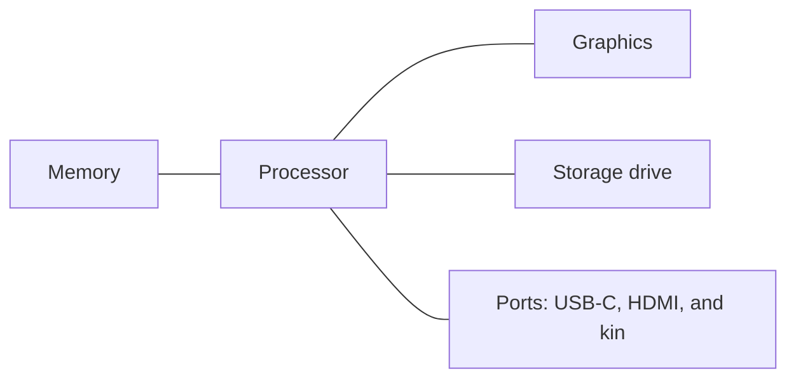
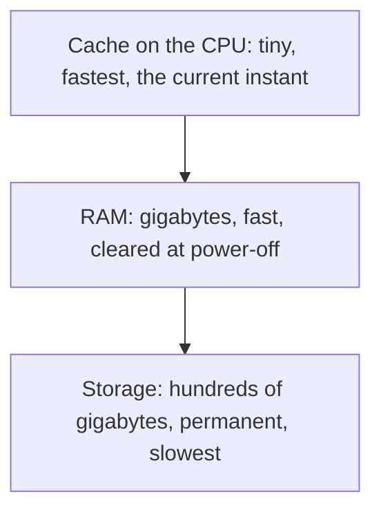

# Chapter 5: Processors, Memory, and the AI PC

Two blocks from Saguaro Hall, a storefront with a cactus wren painted on the window fixes what the neighborhood breaks. Amir Haddad owns Cactus Wren Repair, and his favorite part of the job is not the repairs. It is the moment a customer asks, "Just tell me: is this laptop good?" while holding a spec sheet that might as well be written in code. Cores, gigahertz, gigabytes, TOPS. Amir can read that sheet in ten seconds, match it to the customer in front of him, and explain the verdict in plain words. That skill is this chapter.

Chapter 4 kept calling hardware "the machine" because the software story came first. Now the case comes off. The processor the OS was juggling, the memory it was rationing, and the chip behind those on-device AI features all get names, numbers, and prices. Chapter 1 promised that Chapter 5 would look at all three chips properly, and this is that chapter: the CPU, the GPU, and the NPU that turns a laptop into an AI PC. None of this is trivia for IT majors. Every field buys machines, budgets for them, and lives with the choice for years, and the person in the room who can read a spec sheet is the one everybody trusts with the decision.

Here is the route. First you will open the case and meet the board that connects everything, from desktop towers to the watch on a wrist. Then the three processors: what each one does, and how to match the work to the chip. Third, the memory ladder, where Chapter 4's "memory pressure" gets its hardware explanation and the RAM-versus-storage confusion dies for good. Finally, you will read a full spec sheet line by line, then learn to do what Amir does across the counter: turn accurate numbers into visuals a customer understands at a glance. That is Skills Lab 5A, and the PowerPoint skills from Chapter 4 are about to earn their keep.

## Module Overview 🧭

* **Estimated time:** 4-5 hours
* **Prerequisites:** None (chapters teach from zero), builds on Chapter 1 (machine field guide) and Chapter 4 (OS resource management, PowerPoint outline import)
* **Deliverables:** Skills Lab 5A deliverable, Quick Checks

## Learning Objectives 🎯

By the end of this chapter, you will be able to:

* **MLO-5.1 (Understand):** Explain how the system board connects processors, memory, and ports into one working machine (Section 5.1)
* **MLO-5.2 (Analyze):** Differentiate the CPU, GPU, and NPU and match each processor and memory type to the work it serves (Section 5.2)
* **MLO-5.3 (Apply):** Translate a device spec sheet into accurate, audience-ready visuals in PowerPoint (Section 5.4)

### This chapter aligns with the following Course Learning Outcomes

* **CLO I (Analyze):** Differentiate the hardware components of a computer system and explain how each supports processing, input, output, and storage
* **CLO VIII (Understand):** Outline the steps for planning and implementing a technology solution, from needs analysis to rollout
* **CLO XIII (Apply):** Produce documents, spreadsheets, databases, and presentations with industry-standard productivity software

---

## 5.1 One Recipe, Every Package

Chapter 1's field guide sorted computers by their packaging: phones, tablets, laptops, desktops, servers, wearables. Open any of them and the packaging story ends, because inside they follow one recipe. A processor to think, memory to hold the current work, storage to keep everything else, and connections to the world. What differs is how the recipe is laid out, and that layout decides something buyers rarely consider until too late: what you can change later.

### The Board Everything Rides On

Unscrew a desktop's side panel and the first thing you see is the **system board** (also called the motherboard): the large circuit board that every other part plugs into. The processor sits in its own seat on the board. Memory sticks snap into their sockets. Storage drives connect by cable or slide into their own slots. An **expansion card**, a plug-in board that adds a capability such as serious graphics power, drops into a long slot near the back. The board is less like a brain and more like a city grid: it decides where everything lives and how the traffic flows.

That traffic moves on a **bus**: the shared wiring that carries data between the processor, memory, and every device on the board. You never shop for a bus, but you feel it constantly, because a computer can only move as fast as its slowest busy road. When a spec sheet brags about a faster memory type or a faster drive connection, the honest translation is: they widened a road.

The diagram below shows the grid in schematic form: the processor at the center of the board, with buses running out to memory, storage, graphics, and the ports where the outside world connects.



The desktop's version of the recipe is the roomy one. Sockets and slots sit in the open, and parts come in standard sizes. One more part rounds out the tour: the power supply, the box that converts wall power into the steady low voltages chips need. Roomy has a payoff. On a desktop, memory, storage, and the graphics card can usually be swapped or upgraded years later, which is exactly why Amir's shop loves them.

### The Shrinking Act

Fold that same recipe into a laptop and the roominess goes first. To save space and battery, laptop makers solder many parts, memory included, straight onto the board. Soldered parts cannot be swapped, so the memory a laptop ships with is often the memory it retires with. The battery and storage drive frequently remain replaceable, and the rest is decided at checkout.

Phones, tablets, and wearables finish the shrinking act with the **system on a chip** (SoC): the processor, graphics, AI hardware, memory controller, and more, manufactured together as one chip. An SoC is why a phone fits in a pocket, starts instantly, and sips battery, and it is also why nobody upgrades a phone's memory. There is no stick to swap. The parts are not merely close together. They are the same piece of silicon.

None of these packages is the "real" computer. A smartwatch runs the full recipe: SoC, memory, storage, radios, battery. The trade runs on a single axis, and it is the first buying insight of this chapter:

| Package | How the parts are laid out | What you can change later |
| ------- | -------------------------- | ------------------------- |
| Desktop | Standard parts in sockets and slots | Memory, storage, graphics card, and more |
| Laptop | Mixed: some socketed, much soldered | Often storage and battery, rarely memory |
| Tablet and phone | One SoC plus soldered parts | Nothing inside |
| Wearable | One tiny SoC, sealed | Nothing at all |

Read the last column as a message from your future self. The less a device can change later, the more the day-one configuration is a long-term decision, and Section 5.3 turns that into a concrete memory rule.

### Try It Yourself 5.1: Soldered or Socketed? 🛠️

**Predict:** Consider the laptop you own or want. Commit two answers in writing: can its memory be upgraded later (yes or no), and can its storage (yes or no)?

**Run:** Check the claim the professional way. Search the model name plus "upgrade memory" and look for the maker's own support page or a teardown on a repair site such as iFixit. Chapter 2's rule applies: the maker's page or a photographed teardown beats a forum's memory of it.

**Explain:** In 1-2 sentences, report what is soldered and what is socketed on your machine, and state what that means for how you would configure its replacement on day one.

### Doors in the Case

The recipe's last ingredient is the set of **ports**: the sockets on the outside where the world plugs in. The port tour on a current machine is short, because one connector took over. **USB-C** is the small, oval, reversible connector that now carries charging, data, and displays on everything from phones to monitors.

One warning keeps the tour honest: USB-C is a shape, not a speed. The same oval plug can carry a slow trickle or a torrent (the fastest versions carry the **Thunderbolt** label), and it can deliver a lot of power or barely any. Two identical-looking ports on one laptop can have different abilities, and the spec sheet, not the plug, tells you which is which. Beyond USB-C you will still meet USB-A (the classic rectangle), HDMI for displays and projectors, a headphone jack, and on desktops, Ethernet for wired networking. Laptops ship fewer ports every year, which is why the working world runs on hubs and adapters. "How many ports, and which kind" belongs on a buyer's checklist next to the glamour specs.

### Try It Yourself 5.2: Census of Doors 🛠️

**Predict:** Without looking, write down how many ports your main computer has, and name the types. Commit to a total number.

**Run:** Now walk the edges of the machine and count for real, using this section's names: USB-C, USB-A, HDMI, headphone, anything else. On a phone or tablet, the census is fast.

**Explain:** In 1-2 sentences, compare the count to your prediction and state what your machine's port set assumes about how you work. What would you need an adapter for tomorrow?

### Heat, the Uninvited Part

One part appears on no spec sheet and shapes them all: heat. Every chip converts electricity into work plus warmth, and a chip that overheats protects itself by slowing down, a behavior called **thermal throttling**. That explains three everyday observations. A laptop on a blanket crawls while the same laptop on a desk flies, because the blanket sealed the vents. Fans roar during a video export, because the machine is paying its heat bill. And desktops hold a permanent speed advantage, because more room means more cooling, so the same chip can run harder for longer. Fan noise under load is not a defect. It is the sound of the machine staying honest, and blocked vents, not age, are one of the most common "slow computer" causes a repair bench sees.

Power has one more modern wrinkle worth a paragraph. Because USB-C carries charging, laptops, tablets, and phones increasingly share chargers, and the plug negotiates: device and charger agree on a safe wattage before real power flows. A phone charger will top up a laptop slowly, a laptop charger will charge a phone safely, and neither will melt anything. The number to notice when buying a replacement is watts, printed on the charger's face, and the safe rule is to match or exceed what the device shipped with.

### Quick Check 5.1 ✅

1. A friend wants to add more memory to a three-year-old budget laptop and to a desktop of the same age. Predict how each request ends, and name the packaging fact that decides it.
2. Explain what a system on a chip combines, and use it to answer a skeptic who says a smartwatch is "not a real computer."
3. A laptop crawls during video exports on the couch but runs the same exports fine on a desk, and only one of its two identical USB-C ports drives the external monitor. Explain both mysteries with this section's vocabulary.

---

## 5.2 Three Processors, Three Jobs

Every spec sheet leads with the processor, and modern machines carry three kinds. Reading them wrong is expensive in both directions: paying for power a task will never use, or bringing a knife to a rendering job. This section gives each chip its job description, then teaches the matching skill that turns specs into decisions.

### The CPU: A Few Brilliant Workers

The **CPU** (central processing unit) is the machine's general-purpose processor: the chip that runs the OS, executes your apps, and handles whatever logic the day brings. Chapter 4 called the OS a juggler. The CPU is the pair of hands the juggler works with.

Two numbers describe a CPU on every spec sheet. A **core** is one independent worker inside the chip, able to run its own stream of instructions, and current laptop CPUs commonly carry eight to sixteen. **Clock speed**, measured in gigahertz (GHz), is how many billions of work cycles each core runs per second. The instinct is to treat both like horsepower: bigger number, faster machine. The truth needs two corrections. More cores help only when the work splits into parallel streams, which spreadsheets, browsers, and video exports do well and some everyday tasks do not. And clock speeds only compare fairly within the same chip generation, because a newer core often does more per cycle than an older one at the same GHz. That is why a new 3.8 GHz chip can outrun an old 4.4 GHz one, and why "which generation is this chip?" is a sharper question than "how many gigahertz?"

One more wrinkle appears on current spec sheets: the cores are no longer identical. Modern chips mix a few strong performance cores with a squad of efficiency cores that sip power. The OS, juggler that it is, assigns heavy work to the strong ones and background chores to the frugal ones. Apple, Intel, Qualcomm, and AMD all build this way now. For a buyer the takeaway is simple: "10 cores" tells you less than "which 10," and battery life owes as much to the frugal cores as to the battery itself.

### The GPU: Thousands of Simple Workers

The **GPU** (graphics processing unit) inverts the CPU's design. Instead of a handful of brilliant cores, it packs thousands of simple ones that all do the same small operation at once. Drawing a screen is exactly that kind of job: millions of pixels, one similar calculation each, sixty or more times a second. Laptops bundle a modest GPU into the same chip as the CPU, which handles everyday screens fine. Gamers, video editors, and 3D artists buy the **discrete GPU**, a separate chip (the desktop expansion card from Section 5.1) with its own dedicated memory.

The spec-sheet split to know is integrated versus discrete:

| Graphics | Where it lives | Right for |
| -------- | -------------- | --------- |
| Integrated | Inside the CPU package or SoC, sharing memory | Screens, office work, streaming, light photo edits |
| Discrete | Its own chip with its own memory | Gaming, video editing, 3D, serious AI experiments |

Then the GPU got a second career. Researchers noticed that training AI models is also "the same small operation, millions of times," and the data centers behind modern AI filled with GPUs by the tens of thousands. The chip that draws video game explosions and the chips behind the chatbots of Chapter 1 are close cousins. That one fact explains a decade of technology headlines, including why a GPU designer became one of the most valuable companies on Earth.

### The NPU: The Efficient Specialist

The newest worker completes the set you met in Chapter 1's AI PC preview. The **NPU** (neural processing unit) runs AI models on the device with a fraction of the power the CPU or GPU would burn. Where the GPU is a specialist in massive parallel math, the NPU is a specialist in exactly one family of it: the calculations AI models run when they recognize, transcribe, translate, and generate.

The NPU's virtue is efficiency, not raw force. The features it enables run all day in the background without flattening the battery or hijacking the cores your apps need. Think of Chapter 4's live captions, background blur on calls, and the on-device processing behind screen-history search. NPU performance is measured in **TOPS**, trillions of operations per second, and the number now defines a marketing tier. Microsoft's Copilot+ PC label requires an NPU of at least 40 TOPS, alongside minimums for memory and storage. Apple builds the equivalent (its Neural Engine) into every current Mac, iPhone, and iPad, and the AI-PC-class chips from Intel, AMD, and Qualcomm all clear the 40-TOPS bar. When a spec sheet says "AI PC," the honest translation is: this machine has a third processor, and some AI features will run locally, fast, and privately instead of in the cloud.

Keep the claim exactly that size. An NPU does not make a laptop smarter, and its absence does not lock you out of AI. Cloud chatbots and answer engines run fine on any machine with a browser, because the heavy lifting happens in a data center. What the NPU changes is where on-device AI work happens and what it costs in battery, and Chapter 4 already showed you why "where" matters for privacy.

### Numbers That Compare Fairly

Cores, gigahertz, and TOPS still leave a gap: how do you compare two specific chips across brands and generations? The industry's answer is the benchmark, a standardized test run identically on every machine so the scores compare fairly, the way two runners compare by racing the same course. Review sites publish benchmark tables for exactly this reason. One search places any chip in the pecking order in under a minute: the chip name plus "benchmark," read with Chapter 2's habit of preferring an established testing site over a forum. The same search with "release year" dates the generation. You do not need to memorize chip families that change yearly. You need the thirty-second lookup that never changes.

### Matching Work to Workers

Now the skill. The three processors are not good, better, and best. They are different shapes of work:

| The work | Its shape | The right worker |
| -------- | --------- | ---------------- |
| Running apps, logic, spreadsheets, the OS itself | Varied steps, one after another | CPU |
| Drawing screens, gaming, video effects, 3D | The same small math, millions of times | GPU |
| Live captions, transcription, image cleanup, on-device assistants | AI models running all day on a battery | NPU |
| Web chatbots and answer engines | Heavy AI, but in a data center | Someone else's GPU |

The table is a buying tool. A student who writes papers and browses lives on the CPU, and a mid-range one is plenty. A video-editing side business feels every GPU dollar. A field worker who transcribes interviews on battery benefits from the NPU, and a person whose AI use is all in the browser can ignore the AI PC label entirely. The question is never "which machine is most powerful?" It is Chapter 3's question wearing a hardware coat: what is the task, and which worker does that task's shape of work?

The table is a diagnostic tool too, and Amir's bench uses it daily. A customer reports "my games got slow," and the table narrows the suspects the way Chapter 1's six questions do. If everything else on the machine still flies, the CPU is innocent and the eyes go to the GPU and to heat (a vent full of dust throttles a game before anything else). If the whole machine drags, the desk from Section 5.3 is the likelier culprit. Naming the worker that owns the failing job is half the repair ticket, and customers who can do it get better, cheaper diagnoses.

!!! tip "Tech in Your Field"
    The three-worker split is already visible across the majors in this room. Nursing and health sciences students will meet it in bedside ultrasound and imaging carts, where GPUs sharpen images in real time and on-device AI flags readings for a clinician's judgment. Business and entrepreneurship students will spec laptops for teams and learn that ten CPU-comfortable machines beat three overbought ones. The accountant's giant spreadsheet wants cores, and the sales team's captioned calls want an NPU. Visual and performing arts students will feel the GPU directly: rendering, effects, and audio plug-ins are why studio machines cost what they cost. Public safety students will see NPU-style chips inside body cameras and dash systems that blur bystander faces on the device before footage ever uploads. The chips changed what each role can do on the spot. The judgment about what the output means stays with the professional.

### Try It Yourself 5.3: Meet Your Own Chips 🛠️

**Predict:** Chapter 1 had you glance at your machine's About page. Now commit three specifics in writing: your machine's chip name, its core count, and whether it contains an NPU (yes or no).

**Run:** Check all three. On Windows: Settings > System > About for the chip, then Task Manager > Performance, where an NPU appears in the left column if you have one. On a Mac: Apple menu > About This Mac (every Apple silicon Mac includes the Neural Engine). On a phone, search Settings for "About."

**Explain:** In 1-2 sentences, state which prediction missed and what your machine's chip set means for where its AI features run: on the device, or in the cloud.

### Try It Yourself 5.4: Sort the Workload 🛠️

**Predict:** Four new jobs land on one machine, none of them straight off this section's table. The jobs: an accounting macro recalculating forty worksheets. Video effects smoothing shaky 4K drone footage. A phone grouping ten years of photos by face, overnight, on battery. A browser-based AI service drafting a 20-page report. Write next to each job which worker should carry it: CPU, GPU, NPU, or a data center. Commit all four before checking.

**Run:** Now test each answer against the matching table by asking the table's question: what is the shape of this work, and where does it run? Note any job you assigned to a more powerful worker than it needs.

**Explain:** In 1-2 sentences, explain the one that surprised you most, and state the rule you would use next time a task needs sorting.

### Quick Check 5.2 ✅

1. A listing shows a 4.6 GHz CPU from several years ago against a new 4.0 GHz CPU. A friend calls the first one "obviously faster." Give the two corrections this section makes to that reasoning.
2. Why did AI companies fill data centers with GPUs instead of CPUs? Answer in terms of the shape of the work.
3. A customer asks Amir whether skipping the "AI PC" model locks them out of using chatbots for schoolwork. Write the two-sentence answer, including what an NPU changes and what it does not.

---

## 5.3 The Memory Ladder

Chapter 4 blamed most slowdowns on memory pressure without naming the hardware. This section names it, and it starts by killing the most expensive confusion in consumer computing. Memory and storage are not the same thing, and mixing them up leads people to buy the wrong machine with confidence.

### The Desk and the Filing Cabinet

First, the units, because every number in this section wears one. A **byte** is the basic unit of digital size, roughly one typed character. The working world counts them in thousand-fold steps. A megabyte (MB) holds about a minute of music. A gigabyte (GB) is a thousand megabytes, a few hundred phone photos. A terabyte (TB) is a thousand gigabytes, the scale of a whole family's archive. Spec sheets speak almost entirely in GB and TB, so the ladder below is worth thirty seconds of memorizing:

| Unit | Size | An everyday anchor |
| ---- | ---- | ------------------ |
| Byte | One character | The letter "a" |
| Megabyte (MB) | About a million bytes | A minute of music |
| Gigabyte (GB) | About a thousand MB | A few hundred phone photos |
| Terabyte (TB) | About a thousand GB | A family's whole digital archive |

**RAM** (random access memory) is the machine's working memory: the fast, temporary space holding every open app, every browser tab, and the OS itself while they run. Storage (the SSD you will meet properly in Chapter 6) is the permanent library holding every file and program the machine keeps, in use or not. The office metaphor has survived decades because it works: RAM is the desk, storage is the filing cabinet. A bigger desk lets you spread out more work at once. A bigger cabinet lets you keep more files forever. They solve different problems, and no amount of cabinet makes a cramped desk comfortable.

Two differences drive everything else. RAM is faster than even the fastest storage by a wide margin, and RAM is temporary: switch the machine off and the desk is swept clean. That one fact explains three everyday mysteries at once. Unsaved work dies with a power cut. Chapter 4's sleep mode resumes instantly because sleep keeps the desk powered. A restart cures memory pressure because it clears the desk. Storage keeps its contents without power. The numbers on a spec sheet make the relationship visible: a current laptop might carry 16 gigabytes of RAM against 512 gigabytes of storage, a desk one thirty-second the size of the cabinet.

Now Chapter 4's slowdown story gets its mechanism. When open apps outgrow RAM, the OS parks the least-used memory onto the storage drive and fetches it back on demand. Storage is the slower floor of the building, so every fetch is a delay you feel. The machine is not old or broken. Its desk is full, and the OS is working out of the filing cabinet.

The distinction also untangles two warnings that people constantly treat as one. "Memory pressure" (the sluggishness above) is a full desk, and it resets with a restart, costs nothing, and returns when you reopen everything. "Storage full" is a stuffed filing cabinet: the machine refuses new files and updates, no restart helps, and the fix is deleting, offloading, or buying more cabinet. A phone that cannot take one more photo has a storage problem. A laptop that stutters with thirty tabs open has a memory problem. Same word "full," different floor of the building, different repair.

### The Ladder, Rung by Rung

Memory in a computer is organized as a ladder, and one rule governs the whole climb: the closer to the processor, the faster and smaller the memory gets. At the top, on the CPU itself, sits a sliver of cache: ultra-fast memory holding the instructions of the current moment. You will never shop for cache, but it is why chips can keep up with themselves. Below it sits RAM, the desk. At the bottom sits storage, the cabinet: enormous, permanent, and slow by comparison. Data climbs the ladder to be worked on and settles back down to be kept.



Two more residents complete the ladder. **ROM** (read-only memory) is a small permanent chip holding the firmware from Chapter 4's boot story. That code must exist before any drive is readable, and it is unchangeable by design, so the machine can always wake. And **flash memory** is the technology that made modern devices possible: chips that keep their contents without power yet can be rewritten, filling every phone, every memory card, and every SSD. Flash sits at the boundary of this chapter and the next. Chapter 6 is where it becomes storage you choose and buy.

### One Pool for All Three Workers

The three processors from Section 5.2 traditionally kept separate memory: the CPU worked from RAM while a discrete GPU carried its own. **Unified memory** merges the arrangement: one pool of fast memory shared by the CPU, GPU, and NPU, led by Apple's M-series chips and spreading across the industry. Sharing means no time lost copying data between pools, which AI work and video editing do constantly.

It also sharpens the buying stakes. Unified memory is part of the SoC arrangement from Section 5.1, soldered by design, so the pool you buy on day one is the pool the machine dies with. Which brings the ladder to its practical question.

### How Much Desk to Buy

The memory line on a spec sheet is where budget meets honesty, and the reasoning fits in three sentences. Too little RAM and the OS lives in the filing cabinet, which no CPU can outrun. Enough RAM and the desk fits your working day with room to spare. Beyond enough, extra gigabytes mostly sit idle, and the money belongs in a better screen, battery, or drive.

What counts as enough tracks how many plates you keep spinning:

| Desk size | Who it fits |
| --------- | ----------- |
| 8 GB | Tablets, browser-first machines, one-task-at-a-time users |
| 16 GB | The current safe floor for a laptop you will keep for years |
| 32 GB and up | Editors, heavy multitaskers, and virtual machine users (Chapter 4) |

A browser-and-Office day runs comfortably at the floor. Heavy multitaskers, editors, and virtual machine users feel the step up, and know it about themselves already. And the packaging column from Section 5.1 decides how careful to be. On a desktop, guessing low is a fixable mistake. On a soldered laptop or anything with unified memory, the day-one choice is final. Buy the desk for the busiest day you plan to have, not the average one.

### Try It Yourself 5.5: Desk Versus Cabinet, Your Own 🛠️

**Predict:** Write down your machine's two numbers from memory: gigabytes of RAM and gigabytes of storage. Then commit a ratio guess: how many times bigger is the cabinet than the desk?

**Run:** Check both numbers (Settings > System > About on Windows, About This Mac on a Mac, Settings > About on a phone) and do the division.

**Explain:** In 1-2 sentences, state your real ratio, and explain why a manufacturer pairs a small fast desk with a huge slower cabinet instead of making everything RAM.

### Try It Yourself 5.6: Watch the Desk Fill 🛠️

**Predict:** Open Task Manager or Activity Monitor and find the memory percentage in use right now. Write it down. Then predict, with a number, where it will land after you open ten browser tabs of media-heavy sites.

**Run:** Open the ten tabs, watch the memory figure move, then close them and watch it fall.

**Explain:** In 1-2 sentences, connect what you watched to the desk metaphor, and state roughly how many such tabs your machine's desk could hold before the OS starts working out of the cabinet.

### Try It Yourself 5.7: Size Your Own Life 🛠️

**Predict:** Commit two numbers in writing: how many gigabytes your phone's photos and videos consume, and what share of your phone's total storage that is (a fraction like "a third").

**Run:** Check. On iOS: Settings > General > iPhone Storage. On Android: Settings > Storage. Read the photo line and the total, and while you are there, note the biggest surprise in the list.

**Explain:** In 1-2 sentences, compare your guesses to the numbers, and translate your camera roll into this section's units ladder: how many minutes of music would the same space hold?

### Quick Check 5.3 ✅

1. A phone listing says "256 GB memory." Using this section's vocabulary, state what the number almost certainly measures, what a buyer might wrongly conclude, and the question that settles it.
2. Explain why a restart cures memory pressure but does nothing for a full storage drive.
3. A video editor is choosing between 16 GB of unified memory now or "upgrading later." Correct the plan and justify the correction with two facts from this chapter.

---

## 5.4 Reading the Sheet, Showing the Story

Everything so far becomes one practical skill at Amir's counter. A **spec sheet** is the industry's standard self-description of a machine, and you now know what every line means. This section decodes one end to end and gives you the rule that turns specs into recommendations. Then it teaches the second half of Amir's skill: showing the story visually, so someone who will never read a spec sheet still understands the machine.

### Decoding, Line by Line

Here is a listing the shop might post for a refurbished laptop, the kind a student shops for:

```text
Desert Falcon 15 (refurbished)
8-core CPU, up to 4.2 GHz
NPU rated at 45 TOPS
16 GB RAM
512 GB SSD storage
15-inch display, 1920 x 1200
2 x USB-C (one Thunderbolt), 1 x USB-A, HDMI
Battery: up to 14 hours. Weight: 1.7 kg
$679
```

Walk it with this chapter's map. Line two is Section 5.2: eight capable workers, with the generation question worth asking. Line three says the third processor is present and clears the 40-TOPS AI PC bar, so captions, transcription, and on-device assistants run locally. Lines four and five are the desk and the cabinet, at a healthy 16-to-512 pairing. The port line is Section 5.1, including the warning that only one of the two USB-C doors carries Thunderbolt speeds. Nothing on the sheet is jargon anymore. It is a machine described in parts you can name.

The last step of a decode is the verdict, and the rule for verdicts came from Section 5.2's table: match the machine to the task's shape, not to the biggest number on the page. For a nursing student running a browser, Office, and a proctored-exam app, this machine is comfortably more than enough. For a game design student, the missing discrete GPU is the whole story, and no other line rescues it. Same sheet, two honest verdicts, because the verdict lives in the match, not the machine.

You already own a spec sheet, by the way. Chapter 1 pointed you at your machine's About page and promised this chapter would teach you to read every line of it. Open it now and the promise is kept. The chip line is Section 5.2. The memory line is the desk, the storage line is the cabinet, and the OS version line is Chapter 4's support-window question. A device's About page is a spec sheet for a machine you already bought, and reading it is how you know what your next one must do better.

The decode-then-match skill sounds like this across a real counter:

```text
Customer: Is this Desert Falcon good?
Amir:     Good for what? What will it do all day?
Customer: Notes and browsing at school, shows at night.
          I forget my charger a lot.
Amir:     Then read the battery line with me: fourteen
          hours, tested. The eight cores are more than
          notes need, and you can skip the gaming rig's
          graphics card entirely. This one, done.
```

Notice the order: task first, then the one line that decides, then permission to ignore the rest. That is a spec sheet doing its job, and it is also the script for the deck you are about to build.

### Show, Don't Tell

Amir's customers do not want the decode. They want the decision, and they want to see it. Walk past his counter and the sign for the Desert Falcon does not list eight specs. It says, in type visible from the door, "14 hours of battery," with three small lines under it. That is the whole craft: choose the one number that answers the customer's question, make it enormous, and let the detail wait underneath.

The deck skills from Chapter 4 carry the same principle onto slides, with three tools doing the showing:

* **The big number.** One value, huge, with a plain-language label ("14 hours of battery"), and the qualifier in small text or the notes. This is the strongest slide in business life and the easiest to make.
* **The icon plus label.** PowerPoint ships a searchable icon library (Insert > Icons): a battery symbol beside "14 hours," a camera beside "privacy shutter." Icons carry meaning across languages and reading levels, and they carry it fast.
* **The honest comparison.** When the message is "this one versus that one," a small table with a header row, or a simple bar chart (Insert > Chart), shows the gap instead of asserting it. Three bars beat three sentences. Chapter 6 hands the chart-making job to Excel, where the numbers will live.

Here is the whole transformation on one slide, before and after:

```text
Before (the outline's bullet list):
* 8-core CPU, up to 4.2 GHz
* NPU rated at 45 TOPS
* 16 GB RAM
* 512 GB SSD storage
* Up to 14 hours of battery

After (the show slide, for the Note-Taker):
      14 HOURS
   of battery, tested
* AI PC class: captions and transcription on the device
* 16 GB RAM and 512 GB storage
Speaker notes: full spec table lives here, with the
battery test method and the warranty terms.
```

Selection is the half of the craft nobody teaches. Every element you show costs attention, so a spec earns its place on a slide only if the audience's decision changes because of it. The BIOS version is true and useless to a shopper. The battery life is the sale. Cutting accurately is not dumbing down. It is Chapter 4's slide-versus-notes split, applied to numbers: the slide carries what the customer must remember, and the fine print rides in the notes, where the professional can still find it.

Size is part of honesty too. Amir's counter screen is read from three meters away, and a slide that cannot be read is a slide that lied about being communication. The working rule: if the audience must squint, the slide holds too much, so the big number goes enormous, supporting lines stay few and large, and everything smaller than comfortable belongs in the notes. Test it by standing back from your own screen, or shrink the slide thumbnail and see what survives.

One more habit makes the visuals professional. Every icon, image, and chart you add gets **alt text**: the short written description a screen reader speaks aloud when it reaches the graphic. You met the screen reader in Chapter 4 as an OS door for every body. Alt text is you, the author, building your content's side of that door (right-click the object > Edit Alt Text, on either platform). A battery icon's alt text is not "icon." It is "battery icon: 14 hours of battery life." Write it as if reading the slide to someone on the phone, because functionally, that is exactly what it is.

### The Refurbished Question

One more counter conversation belongs in this chapter, because it is where spec reading saves the most money. A **refurbished** device is a used one that has been tested, repaired where needed, wiped, and resold with a warranty, usually at a steep discount. The category runs from manufacturer-refurbished (inspected by the maker, nearly new) to shop-refurbished stock like Amir's, and it is one of the quietest good deals in computing. It is also the greener buy: every refurbished machine is one less manufactured, and Chapter 8 returns to the device lifecycle as an ethics topic.

The deal is only as good as the questions you ask, and this chapter plus Chapter 4 wrote the list:

* **Who refurbished it, and what is the warranty?** A tested device with 90 days of coverage is a different product from a stranger's "works fine."
* **What is the battery's condition?** Batteries age by charge cycles, and a replacement can erase the discount.
* **Was the storage wiped and verified?** The previous owner's data should be provably gone.
* **Can it be upgraded, or is it soldered?** Section 5.1's packaging table decides whether today's specs are forever.
* **How long will its OS be supported?** Chapter 4's question with teeth: a cheap machine two years from its end of support is not cheap.

### Accuracy Survives the Makeover

A warning before the lab, because this is where enthusiasm meets ethics. When you shrink eight specs to one big number, you take on the duty of choosing honestly. A big "512 GB!" over the word "memory" would be a lie: the filing cabinet wearing the desk's name. A chart whose bars start anywhere but zero shows a gap the numbers do not contain. The transformation rule for the lab, and for your working life: simplify the presentation, never the truth. Every number on the slide must trace back to the sheet, wearing its correct name.

### Try It Yourself 5.8: The One Number 🛠️

**Predict:** A customer profile reads: "Retired teacher, wants to video-call grandkids, edits nothing, travels to visit family every month." From the Desert Falcon listing above, commit in writing to the ONE spec you would make enormous on a sign for this customer, and one spec you would cut entirely.

**Run:** Defend your pick against the alternatives by checking each listing line against the customer's three stated facts. Then sketch the sign in three lines: big number, label, one small supporting line.

**Explain:** In 1-2 sentences, explain why your number answers this customer's question and why a different customer would change the sign.

### Quick Check 5.4 ✅

1. Decode this line for a customer in one sentence of plain words: "12-core CPU, 32 GB RAM, no NPU."
2. A poster shows a bar chart comparing two laptops' storage, with the bars starting at 400 GB so one bar towers over the other. The numbers are 512 and 480. What is dishonest here, and what is the fix?
3. What is alt text, who receives it, and what makes "battery icon: 14 hours of battery life" better than "image"?

---

## 5.5 Summary and Retrieval 💡

### Key Concepts

* Every computer follows one recipe (processor, memory, storage, connections) laid out on a system board and its buses. Packaging sets the upgrade story: desktops swap parts for years, laptops solder much of it, and phones, tablets, and wearables fuse the recipe into a system on a chip that never changes. USB-C is a shape, not a speed, and the spec sheet names which ports carry Thunderbolt pace.
* Heat is the invisible spec. Chips that overheat throttle themselves, so blocked vents and thin cases cost speed, and desktops outrun laptops on cooling room alone. Chargers negotiate over USB-C, and watts, not plug shape, decide how fast a device refills.
* Three processors split the work by its shape. The CPU's few strong cores run apps and the OS. The GPU's thousands of simple cores draw screens and power AI data centers. The NPU runs on-device AI efficiently, measured in TOPS, and 40-plus TOPS earns the Copilot+ AI PC label. Matching the task's shape to the worker beats chasing the biggest number.
* Memory is a ladder: cache on the chip, RAM as the working desk, storage as the permanent filing cabinet, with ROM holding the boot firmware and flash memory underlying phones and SSDs. RAM clears at power-off, which is why restarts cure pressure and power cuts eat unsaved work. Unified memory pools the desk for all three processors and is fixed at purchase, so buy for the busiest day you plan to have.
* A spec sheet is a machine described in parts you can now name, and the verdict lives in the match between machine and task. Refurbished devices are the quiet good deal when the warranty, battery, wipe, packaging, and support window all check out. Showing the story means one honest big number, icons with labels, comparisons with headers and zero-based bars, alt text on every graphic, and every displayed value traceable to the sheet under its correct name.

### Key Terms

See course glossary for full definitions

* system board, bus, expansion card, port, USB-C, Thunderbolt, system on a chip, thermal throttling (Section 5.1)
* CPU, core, clock speed, GPU, discrete GPU, TOPS (Section 5.2)
* byte, RAM, ROM, flash memory, unified memory (Section 5.3)
* spec sheet, refurbished, alt text (Section 5.4)

### Retrieval Practice

Answer from memory before checking back through the chapter.

1. Name the three processors and give each one's job in five words or fewer.
2. Explain the desk-and-filing-cabinet metaphor: which part is which, what happens at power-off, and what the OS does when the desk overflows.
3. State the packaging rule that decides whether "upgrade it later" is a real option, and name the two package types where it never is. Then name the five questions to ask before buying a refurbished device.
4. A spec line reads "NPU rated at 45 TOPS." Give the plain-language translation and the marketing label the number clears.
5. Recite the three honesty rules for spec visuals: the naming rule, the bar-chart rule, and where the fine print goes.

---

## 5.6 Skills Lab 5A: Show, Don't Tell: Hardware Specs as Visuals

**Goal:** Turn Cactus Wren Repair's refurbished-device spec sheets into an accurate, glanceable sales deck for the shop's counter screen, where every big number is honest and every graphic carries alt text.

**Dataset or starter files:** Three provided files in `assets/code/chapter-05/` from the course data pack. `spec-sheets.docx` is the shop's reference document: full spec tables for three refurbished devices, three customer profiles, and Amir's shop notes. `spec-outline.docx` (Windows) and `spec-outline.rtf` (Mac) carry the same content as an importable outline, Heading 1 per slide and Heading 2 per bullet, the Chapter 4 skill. Download the data pack from Canvas, extract it, and work at the extracted `cis105` root. You will import and transform the provided content, never retype it.

**Scenario:** Amir Haddad refurbishes trade-ins at Cactus Wren Repair and sells them with a warranty. His spec sheets are accurate and unreadable to walk-in customers, so the counter screen shows the sheets and sells nothing. He wants the deck version: one device per slide, the right number big, the fine print in reserve. The outline ships with the shop's real problems in it: one spec wears the wrong name, one line no customer needs, and one slide is a wall of numbers.

!!! note
    This lab requires desktop PowerPoint (the outline import is not available in PowerPoint for the web). The icon library and Designer need a Microsoft 365 sign-in and an Internet connection.

### Part 1: Foundation (Aligns with MLO-5.3)

1. Read `spec-sheets.docx` first, end to end: three device tables, three customer profiles, the shop notes. This is the source of truth your slides must trace back to. Close it before importing.
2. Create a blank presentation, save it as `skills-lab-5a-lastname.pptx`, and import the outline exactly as in Chapter 4 (Windows: Home > New Slide arrow > Slides from Outline, `spec-outline.docx`. Mac: Home > New Slide arrow > Outline, `spec-outline.rtf`). Delete the leftover blank slide.
3. Re-assign the first slide to the Title Slide layout, apply one theme suited to a shop's counter screen, and confirm your slide count against the outline's section count. Record the count for Questions & Analysis.
4. Audit pass, on paper: compare each imported device slide against its table in `spec-sheets.docx` and note every bullet that disagrees with the table or would mean nothing to a walk-in customer. Part 2 starts from your notes.

### Part 2: Application (Aligns with MLO-5.2, MLO-5.3)

1. Fix the wrong name. Your Part 1 audit should have flagged one spec bullet wearing the wrong name (check every memory and storage line against `spec-sheets.docx` and Section 5.3's desk-versus-cabinet distinction). Correct the label on the slide, and record the device, the wrong wording, and your fix for Questions & Analysis.
2. Cut what no customer needs. One bullet among the device slides is true, technical, and useless to a walk-in shopper. Delete it from the slide and paste it into that slide's notes pane instead, so the fine print survives where a professional can find it.
3. Transform each of the three device slides into a "show" slide. Each gets ONE big number with a plain-language label, chosen for the device's likeliest buyer from the customer profiles. Keep at most three short supporting lines, and add one icon from Insert > Icons beside the big number. Every remaining value must appear under its correct name.
4. Rebuild the "Side by Side" slide, which arrived as a wall of numbers. Choose one of two visuals. Either build a small comparison table with a header row: price, memory, storage, and one more row you select. Or insert a bar chart of the three prices via Insert > Chart, with bars starting at zero. Delete whatever the visual now makes redundant.
5. Add alt text to every icon, image, and chart in the deck (right-click > Edit Alt Text): what it shows and the value it carries, written for a listener who cannot see the slide.

### Part 3: Extension (Aligns with MLO-5.1, MLO-5.2)

1. Finish the "Which One Fits You" slide: match each of the three customer profiles to one device. Then write speaker notes in Amir's voice for that slide, justifying each match with exactly two specs per customer. Use Section 5.2's shape-of-work rule instead of "it is more powerful."
2. One profile mentions wanting to "add more memory next year." In the notes of the device you matched to that customer, add two sentences a professional would say across the counter. State whether that plan works on this device's packaging, and what to buy instead if it does not (Sections 5.1 and 5.3).
3. Rehearse once with Presenter View, checking each slide against the accuracy rule: could you trace every displayed number back to `spec-sheets.docx` under its correct name? Fix anything that fails.
4. Export `skills-lab-5a-lastname.pdf` for the shop's records, then add the final "Questions & Analysis" slide (Section Header layout) with your answers in its notes pane, the Chapter 4 convention.

### Questions & Analysis 🤔

Answer both questions in the notes pane of your final slide. These answers carry significant rubric weight.

1. Report the mislabeled spec you caught in Part 2: the device, the exact wrong wording, and your fix. Then explain the two ways that label could have cost someone money: what a customer buying "memory" would wrongly believe, and what it would cost the shop when the customer found out. Use the desk-and-cabinet distinction in your answer.
2. Defend your favorite transformation in the deck (a big number, an icon, or your comparison visual) against the accusation that you "dumbed it down." Name what you cut, where the fine print went, and which customer profile your choice serves. Then state one situation where the full spec table, not the visual, is the right deliverable.

**Submission:** Submit two files: your presentation `skills-lab-5a-lastname.pptx` (deck, speaker notes, alt text, and the final Questions & Analysis slide with answers in its notes pane) and the exported `skills-lab-5a-lastname.pdf` (slides only). Both files use your own last name.

### Rubric: Skills Lab 5A

This lab is graded with the standard
[Skills Lab Rubric](../skills-lab-rubric.md): four criteria at
4 points each, 16 points total. The criteria are Code Accuracy and
Efficiency, Output Quality, Documentation and Code Comments, and
Analysis, Interpretation, and Response to QUESTION(s).

---

## 5.7 Review Questions 🔄️

1. **Remember:** Name the part of the machine each of these spec-sheet lines describes, using this chapter's terms: "8-core, up to 4.2 GHz," "45 TOPS," "16 GB," "512 GB SSD," "2 x USB-C (one Thunderbolt)."

2. **Understand:** Explain to a first-time buyer why a phone's memory can never be upgraded while a desktop's usually can, and what that means about how carefully each should be configured at purchase.

3. **Apply:** A graphic design student, an accounting student, and a student who mostly writes and browses each have $800 for a refurbished machine. Using the shape-of-work table and the memory rule, state the one spec each student should prioritize and the one spec each can safely ignore.

4. **Analyze:** A machine feels fast in the morning and crawls by afternoon, and Task Manager shows memory at 96 percent with the CPU nearly idle. A well-meaning relative recommends "a faster processor." Differentiate the diagnosis from the prescription: which rung of the memory ladder is the bottleneck, why the CPU upgrade would not help, and what two changes (one free, one paid) would?

---

## Further Reading 📖

* [GCFGlobal: Inside a Computer](https://edu.gcfglobal.org/en/computerbasics/inside-a-computer/1/) - A free, photo-illustrated walk through the system board, CPU, RAM, and expansion cards this chapter names.
* [Microsoft Learn: Copilot+ PCs and NPUs](https://learn.microsoft.com/en-us/windows/ai/npu-devices/) - Microsoft's own developer-facing definition of the 40-TOPS Copilot+ hardware tier and what runs on the NPU.
* [Apple Support: Mac Tech Specs](https://support.apple.com/specs) - The official spec sheets for every Mac, useful practice for the decoding skill on real listings.
* [iFixit](https://www.ifixit.com/) - Teardowns and repair guides that show exactly which parts of real devices are socketed, soldered, or sealed, plus repairability scores.
* [Microsoft Support: Add alternative text to visuals](https://support.microsoft.com/en-us/office/add-alternative-text-to-a-shape-picture-chart-smartart-graphic-or-other-object-44989b2a-903c-4d9a-b742-6a75b451c669) - The official steps and writing guidance for the alt text Skills Lab 5A requires on every graphic.

---

## Looking Ahead ⏩

You can now open the case, name every worker inside, and translate a spec sheet for any audience. Chapter 6 follows the recipe to its edges. Touchscreens, cameras, and sensors get data in. Displays and printers get it out. And the storage tiers where data finally rests run from the SSD in your laptop to the cloud. The Skills Lab thread reaches Excel at last, where Cactus Wren Repair's device inventory becomes your first working workbook, and the numbers you have been putting on slides start calculating themselves.
