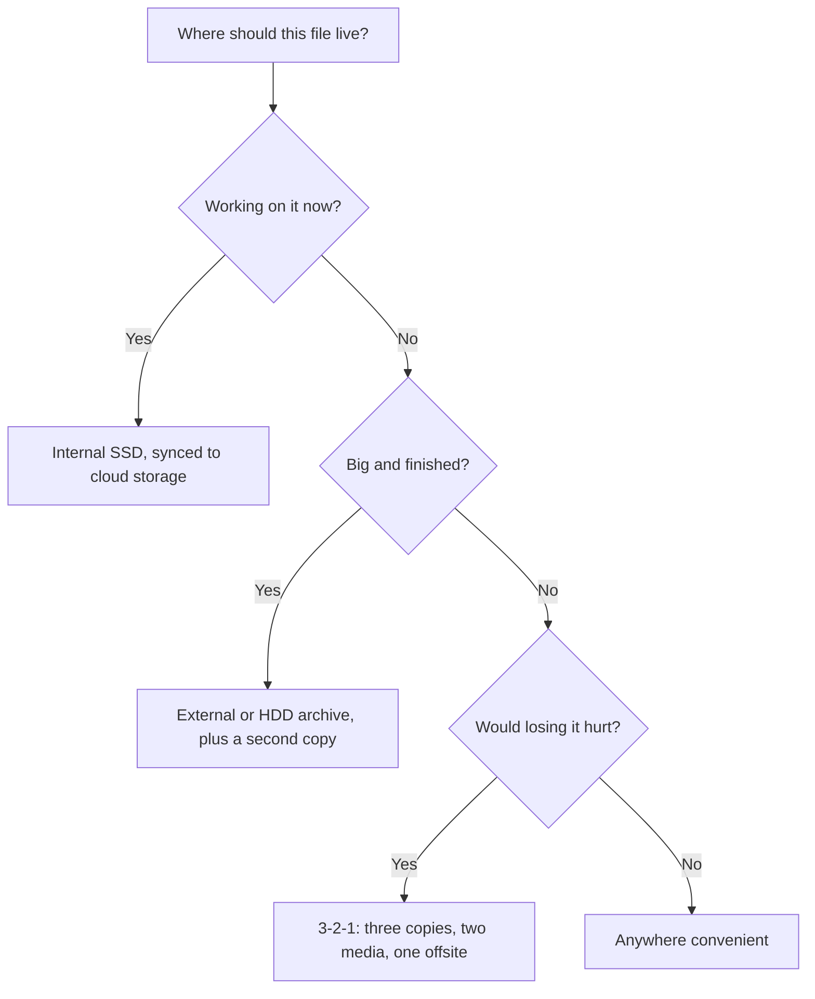

# Chapter 6: From Touchscreens to the Cloud: Devices and Storage

The customer at Cactus Wren Repair is calm the way people are calm right before they are not. Her laptop will not power on, and her capstone project, the only copy, is inside it. Amir Haddad can usually rescue the drive, and this time he does, but he makes her sit for what he calls "the talk": your files should never have one address. The same afternoon, a different problem waits in his back room. Fifty-four refurbished devices sit on shelves, tracked on a whiteboard that ran out of room in March. Both problems belong to this chapter, because both are about the physical edges of computing. How does data get into a machine? How does it get out? And where should it live, so that one dead laptop is an errand instead of a disaster?

Chapters 4 and 5 covered the software layer and the thinking parts. This chapter walks the rest of the machine. Touchscreens, cameras, and sensors feed it. Displays and printers answer back. And the storage tiers where data finally rests run from the SSD your Chapter 5 spec sheet named to the cloud you met in Chapter 1. The selection skill from Chapter 5 finishes here. By the end of Part II you can read the whole machine, inside and out, and choose every piece of it against a task.

Here is the route. First the inputs, which have quietly become cameras, voices, and sensors as much as keyboards. Then the outputs, plus the ergonomics that decide whether your body can live with your setup. Third, the storage tour: drives, cards, cloud, and the backup habit that would have spared Amir's customer her worst week. Finally, the Skills Lab thread arrives at Excel. Amir's whiteboard becomes `device-comparison.xlsx`, your first working workbook, and the grid starts doing the math you have been doing by hand.

## Module Overview 🧭

* **Estimated time:** 4-5 hours
* **Prerequisites:** None (chapters teach from zero), builds on Chapter 5 (memory, flash, spec sheets) and Chapter 1 (cloud computing)
* **Deliverables:** Skills Lab 6A deliverable, Quick Checks

## Learning Objectives 🎯

By the end of this chapter, you will be able to:

* **MLO-6.1 (Understand):** Explain how today's input and output devices carry data between people and machines (Section 6.1)
* **MLO-6.2 (Analyze):** Select storage, sync, and backup arrangements that fit a task by weighing speed, capacity, portability, and risk (Section 6.3)
* **MLO-6.3 (Apply):** Build an Excel worksheet that organizes, calculates, and summarizes device data with formulas and functions (Section 6.4)

### This chapter aligns with the following Course Learning Outcomes

* **CLO I (Analyze):** Differentiate the hardware components of a computer system and explain how each supports processing, input, output, and storage
* **CLO XIII (Apply):** Produce documents, spreadsheets, databases, and presentations with industry-standard productivity software

---

## 6.1 Getting Data In: The Machine's Senses

Chapter 1 defined data as the raw material of every information system. An **input device** is any hardware that gets data into the machine: your fingers on glass, your voice in a microphone, a barcode under a red light. For decades "input" meant a keyboard and a mouse. Your generation's machines watch, listen, and sense, and knowing the full menu is how you choose the right entrance for the data in front of you.

### Fingers, Keys, and Pointers

The **touchscreen** turned the display into an input device, and it now rules phones, tablets, kiosks, and car dashboards. Touch wins wherever the target is visual and the session is short: tap the drink, sign the receipt, pinch the map. It loses to the keyboard the moment text gets long, which you know from experience: nobody writes a ten-page report on glass by choice.

The keyboard survives every prediction of its death because it remains the fastest honest way to move words from a brain into a machine. Physical keys for desks, on-screen keyboards for pockets, and a growing middle ground of folding and roll-up travel keyboards. The mouse survives alongside it, joined by the laptop's trackpad and the **stylus**, the pen-shaped pointer that gives artists and note-takers pixel-level precision plus pressure. If you have watched a tablet artist sketch or a nurse sign a screen, you have watched the stylus justify itself.

Game controllers round out the hands-on family, and they long ago escaped gaming. The same thumbstick-and-trigger layout drives warehouse robots, hospital imaging equipment, and remotely piloted drones, because decades of game design made it the most practiced precision interface on Earth.

### Cameras, Scanners, and the Codes on Everything

A camera is an input device the moment software reads meaning from its pictures. Your phone's camera deposits checks by photographing them, translates menus by reading them, and unlocks the phone by recognizing your face. The flatbed scanner's job (turn paper into files) now largely rides in your pocket: point the camera at a document and the OS squares it, sharpens it, and saves a PDF.

The camera's quietest trick is reading. **Optical character recognition** (OCR) turns photographed text into editable, searchable text, and it now runs everywhere. Select the text inside a photo. Copy a phone number off a flyer. Point the camera at a menu in another language and read the translation live. Paper stopped being a dead end the day pictures of words became words.

The workhorse of business input is smaller than either: the **barcode**, machine-readable stripes or squares that identify an item at a glance. The striped version rings up groceries. The square version, the QR code, carries a whole web address, which is why menus, tickets, and payment systems lean on it. Scanning beats typing for one reason worth stating plainly: a scan cannot mistype. When Amir checks in a trade-in, the barcode wand reads the serial number in one pass, and the number lands in his records exactly as printed. Chapter 2's warning still applies to the QR square taped to a parking meter, though: the code is an address you cannot read before visiting, so the destination deserves a glance before you tap.

### Voices and Sensors

Speech became a serious input channel the moment recognition got good enough to trust, and it now lives at the OS level you met in Chapter 4. Dictation types what you say in any app (press ++win+h++ on Windows, or use Edit > Start Dictation on a Mac). Voice assistants take commands. Live transcription turns a lecture into text in real time, on the NPU when the machine has one (Chapter 5). Voice wins when hands are busy and when typing is slow or painful. For many people it is the primary door into the machine, which is exactly the accessibility point Chapter 4 made: more doors, same building.

The quietest inputs outnumber all the others. A **sensor** measures something physical (light, motion, temperature, location, heart rate) and feeds it to software without anyone typing anything. Your phone carries a dozen: the accelerometer that rotates the screen, the GPS receiver that finds you, the ambient light sensor that dims the display. Chapter 1's wearables and IoT devices are sensor bundles with a network connection, and they are why modern businesses collect data nobody enters. The thermostat at Saguaro Hall logs the room. Nobody types the temperature.

One table gathers the section into the selection skill this Part keeps building:

| The data in front of you | The right entrance |
| ------------------------ | ------------------ |
| A quick choice on a screen | Touch |
| Real text, at length | Keyboard |
| A signature, a sketch, precise marks | Stylus |
| A document, a code, a face | Camera or scanner |
| Words while your hands are busy | Voice |
| The physical world, continuously | Sensors |

!!! tip "Tech in Your Field"
    Input devices decide the pace and safety of daily work across the majors in this room. Nursing students will scan barcoded medication and patient wristbands before administering a dose, a double-check that has prevented countless errors, and will chart by voice when hands are gloved. Business and entrepreneurship students will run checkouts where a scanner, a card reader, and a receipt printer do in four seconds what a ledger took minutes to do. Visual and performing arts students will work through styluses, drawing tablets, and audio interfaces, inputs precise enough to be instruments. Public safety students will wear body cameras and file reports by voice from the field. In every case the input device changed who can capture data and where. Judging what the data means stayed with the professional.

### Try It Yourself 6.1: Census of Senses 🛠️

**Predict:** Count from memory: how many distinct input devices and sensors does your phone carry? Commit a number, then list the ones you can name.

**Run:** Hunt for the rest. Check the camera count, the microphone, and the fingerprint or face unlock. Then catch the quiet ones in the act: rotate the screen (accelerometer), open a maps app (GPS), watch the screen dim in a dark room (light sensor).

**Explain:** In 1-2 sentences, compare your count to what you found and name one input on the list that a business could use to collect data without anyone typing.

### Try It Yourself 6.2: Say the Words 🛠️

**Predict:** You will dictate one paragraph instead of typing it. Commit two guesses in writing: how many errors will land in three sentences of normal speech, and which kind of word will trip it (names, punctuation, or technical terms).

**Run:** Open Word, press ++win+h++ (Windows) or use Edit > Start Dictation (Mac), and speak three sentences about your week, punctuation spoken aloud ("period"). Read what landed.

**Explain:** In 1-2 sentences, compare the error count and error type to your prediction, and name one task in your week where dictation would beat typing.

### Quick Check 6.1 ✅

1. A clinic wants to eliminate typos in patient wristband checks, and a warehouse wants to log deliveries without a keyboard. Name the input device that serves both, and state the one-sentence reason it beats typing.
2. Classify each as an input device, a sensor, or both: a laptop camera used for sign-in, a phone's GPS receiver, a barcode wand, a smartwatch heart-rate monitor.
3. A friend says voice input is "just a convenience feature." Give two situations from this section where it is the primary or safest way in.

---

## 6.2 Getting It Out, Comfortably

An **output device** is any hardware that carries results from the machine back to people: screens, printers, speakers, and the new headsets that wrap the screen around your head. Output is where your work faces its audience, and this section ends with the part of the setup most students ignore until it hurts: the body positioned in front of all that output.

### The Screens You Stare At

The display is the output device you use most, and two numbers on its spec sheet do most of the talking. **Resolution** is the count of **pixels**, the tiny dots of color that make up the picture, written as width by height. A 1920 x 1080 (Full HD) panel remains the workday standard, and 3840 x 2160 (4K) packs four times the dots for photo and video work. **Refresh rate**, measured in hertz (Hz), is how many times per second the screen redraws: 60 Hz suits documents, and higher rates make motion smoother for gaming and video work.

The buying logic is Chapter 5's logic: match the screen to the task's shape. A writer benefits from a taller, sharper screen more than a faster one. A gamer feels refresh rate before resolution. A photo editor pays for color accuracy that no spec number fully captures. One more output habit pays daily: a laptop plus one external monitor is the cheapest productivity upgrade in office life, and the HDMI and USB-C ports from Chapter 5 are how it connects. Projectors extend the same idea to a room, which is where your Chapter 4 deck meets its audience.

### Paper, Sound, and Worlds

Printers refuse to die because paper still signs, posts, and hands out. The choice is a two-way decision students and small businesses face constantly. An **inkjet printer** sprays liquid ink: cheap to buy, strong at color and photos, and expensive per page, with cartridges that clog when idle. A **laser printer** fuses powdered toner: costlier up front, fast, crisp on text, and cheap per page in volume. The decision rule is honest arithmetic: count pages per month, then price the ink or toner per page, because the purchase price is the smallest number in a printer's lifetime cost.

| | Inkjet | Laser |
| --- | ------ | ----- |
| Up-front price | Lower | Higher |
| Cost per page | Higher | Lower |
| Best at | Photos, color, occasional printing | Text, volume, speed |
| Weakness | Cartridges clog and run dry | Color models cost more |

Two printer footnotes save students money. First, most home models are multifunction machines now, folding the scanner and copier into the printer, which is worth knowing before buying a separate scanner. Second, the cheapest printer is the one you skip. "Print to PDF" appears in every print menu, and Chapter 1's PDF habit means many "please print" requests can end as a clean file instead of a warm page. Reach for paper when paper is the point, and for PDF the rest of the time.

Speakers and headphones carry the machine's voice, and audio is half of how you are judged on every video call, which working life now runs on (Chapter 2). The built-in laptop microphone picks up the room. A modest headset picks up you, and it prevents the echo that makes meetings miserable. One output habit belongs in every professional's kit: before any presentation or interview, test the audio path end to end (Chapter 4's rehearsal rule, extended one plug outward).

Output also includes the doors Chapter 4 opened. For a screen-reader user the machine's primary output is spoken, and for a captions user it is text rendered from sound. The alt text you wrote in Chapter 5 is exactly this: authoring your content so it survives the trip through a different output device. Output is not one channel, and professionals who remember that reach more of every audience.

The newest outputs stop rendering to a rectangle. **Virtual reality** (VR) headsets replace your view entirely, and **augmented reality** (AR) layers information onto the world you still see. Gaming drives the headlines, and the working uses are quieter. Surgical and equipment training lets students fail safely. Architects walk clients through unbuilt rooms. Technicians see a repair diagram floating on the machine they are fixing. Headsets remain a specialized purchase, but "the display is a place now" is worth filing next to Chapter 4's cloud desktops: the screen keeps escaping the desk.

### A Setup Your Body Can Live With

All of these devices meet a human body, and the body keeps score. **Ergonomics** is the practice of fitting the workspace to the person instead of forcing the person to fold around the workspace. It is not a wellness luxury. Repetitive strain builds in wrists, necks, and backs one comfortable-seeming hour at a time, and students who live on laptops collect the same aches as the office workers the rules were written for.

The five checks that matter, in the order your body notices:

* **Screen top at or just below eye level**, about an arm's length away. A laptop on a desk fails this test by design, which is why stands and external keyboards exist.
* **Elbows near ninety degrees**, shoulders down, wrists straight and floating instead of bent up onto the desk edge.
* **Feet flat**, chair supporting the lower back. Perching is a posture with a countdown timer.
* **Light across, not behind or in front.** A window behind the screen means squinting, and behind you means glare.
* **Eyes get breaks on schedule.** The 20-20-20 habit: every 20 minutes, look at something 20 feet away for 20 seconds. Screens do not blink enough, and your eyes bill you at the end of the day.

None of this requires equipment beyond a laptop stand's worth of textbooks. It requires noticing, which is why the exercise below makes you audit the setup you are using right now. And phones count: the head tilted at a screen in a lap is the posture doctors now name after texting, and the fix is the same one as the laptop's. Raise the screen, not the strain.

### Try It Yourself 6.3: Audit the Cockpit 🛠️

**Predict:** Score your current setup from memory against the five checks above. Commit a written pass or fail for each of the five before you look up.

**Run:** Now check for real, in order: screen height, elbow angle, feet and back, light source, and when your eyes last left the screen. Fix the two cheapest failures on the spot (raise the screen, move the light, plant the feet).

**Explain:** In 1-2 sentences, report which checks failed and what each fix cost you. (The usual answer is nothing but attention, which is the point.)

### Quick Check 6.2 ✅

1. A club needs to print 400 black-and-white flyers a month, and a photography student prints a dozen color portfolio pages a term. Assign each a printer type and defend the assignments with the cost logic, not the sticker price.
2. A coworker buys a 4K, 144 Hz gaming monitor "for spreadsheets." Using the match-the-task rule, name the two specs they paid for and what a document worker would have bought instead.
3. Name the five ergonomic checks from memory, and identify which one a laptop on a bare desk always fails.

---

## 6.3 Where Data Rests: Drives, Cards, and Clouds

Chapter 5 left the memory ladder at its bottom rung: storage, the permanent filing cabinet. This section shops that rung properly, because "where should this file live" turns out to be several different questions. Where does it live while you work on it? Where does it live so every device can reach it? And where does it live so that a dead laptop, a stolen bag, or one wrong click cannot erase it? Amir's customer had one answer for all three, and that is the whole story of her bad week.

### Inside the Case: Two Technologies

Two storage technologies still share the market, and Chapter 5's flash memory is the key to both. A **solid-state drive** (SSD) is flash memory in drive form: no moving parts, fast, silent, shock-resistant, and standard in every current laptop and phone. A **hard disk drive** (HDD) stores data magnetically on spinning platters read by a moving arm: slower, mechanical, and cheap per terabyte in a way flash still cannot match.

The split writes its own buying rule. The drive you run from (the OS, your apps, the files of the moment) should be an SSD. Chapter 4's boot relay is the proof: an SSD boots in seconds because nothing has to spin up. The drive that holds a decade of video projects can be an HDD, because archives care about cost per terabyte more than speed. Desktops often carry both. Laptops went all-SSD years ago, and the moving-parts difference is half the reason: a dropped laptop forgives flash and rarely forgives a spinning platter.

One honesty note for spec sheets, in the spirit of Chapter 5: a "512 GB" drive never shows 512 usable gigabytes. The OS, its recovery files, and the difference between how makers and machines count gigabytes all take their cut before you store a single file. Expect the About page to show noticeably less than the box promised, on every platform, and plan purchases against the usable number.

### In Your Pocket and on Your Keys

Storage also travels. The **USB flash drive** puts flash memory on a keychain, and it remains the fastest way to hand a file to the person next to you. The **memory card** is the same idea in a fingernail-sized wafer that slots into cameras, drones, and game consoles. An **external drive** is a full SSD or HDD in a pocket case, plugged in over USB-C, and it is the workhorse of both archives and backups. Optical discs (CDs, DVDs, Blu-ray) closed out their run as personal storage, and you will still meet them in archives, car dashboards, and media collections: durable, cheap, read-mostly, and slow.

| Tier | Speed | Capacity for the money | Carries best |
| ---- | ----- | ---------------------- | ------------ |
| Internal SSD | Fastest | Moderate | The OS, apps, current work |
| Internal HDD | Slow | Highest | Big archives on a desktop |
| External drive | Fast (SSD) or cheap (HDD) | High | Backups, project archives |
| USB flash drive and memory card | Moderate | Low | Hand-offs, cameras, small moves |
| Cloud storage | Depends on your connection | Rented by subscription | Files that follow you, shared work |

One truth spans every row of that table, and it is the reason the last part of this section exists. Drives are consumables. Flash cells wear out with writes, spinning platters and their motors are machines with mileage, and cards and USB sticks lead short outdoor lives. Most drives outlast the devices around them, and some fail young without warning. The professional posture is not to buy "reliable" storage and relax. It is to assume any single copy of anything can vanish today, and to build accordingly, which is exactly where this section is headed.

### The Cloud: Your Files on Every Device

**Cloud storage** is file space rented on a provider's servers and reached over the Internet, and you already own some: OneDrive comes with your Microsoft 365 account, and every phone platform ships its own. The mechanism that makes it feel like magic is **sync**: a folder on your device and a folder in the cloud, kept identical automatically. A file saved on the laptop appears on the phone before you have picked the phone up. Chapter 3's co-editing runs on this, and Chapter 1's AutoSave writes straight into it.

Sync earns its keep the day a device dies, because a synced file exists in more than one place. But the word "identical" hides a trap that this book wants you to see coming. Sync copies your mistakes with the same loyalty as your work. Delete a file on one device and sync deletes it everywhere, promptly. Overwrite the good version with the bad one and every device gets the bad one. (The services keep a recycle bin and version history for a while, which softens the trap without removing it.) Sync is availability: your files, every device, now. It is not, by itself, the thing the next subsection is about.

Cloud storage earns three more lines on its resume. It is the fix for Chapter 5's "storage full" phone. Every platform can keep recent files local and older ones cloud-only, fetched on demand, which turns a stuffed 128 GB phone back into a working one. It is how modern sharing works: a link to one cloud copy beats emailing attachments around, which is Chapter 3's co-editing lesson wearing storage clothes. And it is a trust decision, because your files now live on a company's servers under that company's terms. The two questions from Chapter 4 apply word for word (what does it see, where does it go), and Chapter 8 finishes that conversation.

A related skill saves more student assignments than any device: knowing where files land. Every file lives at an address, a path of folders, and the everyday landing zones are few. Browser downloads land in Downloads. Office apps default to Documents, or to OneDrive's Documents when sync is on, which is why a file "disappears" on the machine and appears on the web. The desktop is a folder too, just one you can see. When a file goes missing, search its name from the Start menu or Spotlight, then note the folder it was hiding in. This course's data pack runs on the same idea: the labs work because you extract the pack and keep its folder structure, so every path in every chapter (like `assets/code/chapter-06/`) points where it promises.

One more verb belongs in this section because Amir's shop lives by it. Deleting a file sends it to a recycle bin, and emptying the bin removes the listing, not necessarily the data, which recovery tools can sometimes resurrect. That is wonderful when the deletion was a mistake and dangerous when the device is leaving your hands. Before a machine is sold, traded in, or recycled, the storage gets wiped: overwritten or securely erased so nothing comes back. It is why Cactus Wren advertises "data wiped and verified" on every refurb, and why "I deleted everything first" is not the same sentence.

### Backup: The 3-2-1 Habit

A **backup** is a separate copy of your data, made so that losing the original is an inconvenience instead of a loss. The professional pattern is the **3-2-1 rule**, and it is the cheapest insurance in computing:

* **3** copies of anything that matters (the original plus two others),
* on **2** different kinds of storage (say, your laptop's SSD and an external drive),
* with **1** copy somewhere else entirely (the cloud, or a drive at a relative's house).

Why three, two, one? Because failures come in flavors. A dead SSD takes one copy. A house fire or stolen bag takes everything in one place. And the mistakes that sync so loyally replicates (deletions, overwrites, and the ransomware Chapter 8 examines) are exactly what the offline, versioned copy survives. The rule sounds paranoid until you price the alternative: Amir's customer was one $60 external drive away from an entirely different week.

The tools are already on your machine, which is the payoff Chapter 4 promised. File History on Windows and Time Machine on macOS back up to an external drive automatically, keeping versions, so yesterday's draft is recoverable after today's bad edit. Pair either with cloud sync for the offsite copy and a student's whole academic life meets the 3-2-1 bar for the cost of one drive.

Choosing where a file lives stops being guesswork once you ask what the file is for. The decision tree below walks the question the way this section did: prose first, then the picture.

Ask first: am I working on this file now? Current work belongs on the internal SSD, synced to the cloud so it follows you and survives a dead device. Ask next: is this an archive, big and finished? Archives belong on cheap capacity, an external or internal HDD, with a second copy elsewhere. And for anything that would hurt to lose, the answer is not a place but a pattern: 3-2-1, with one copy offline and elsewhere.



### Try It Yourself 6.4: Advertised Versus Usable 🛠️

**Predict:** Your machine's storage was sold with a round number on the box. Commit two numbers in writing: the advertised size, and how many usable gigabytes you expect the OS to report.

**Run:** Check. On Windows: Settings > System > Storage. On a Mac: System Settings > General > Storage. On a phone: the storage screen you visited in Chapter 5.

**Explain:** In 1-2 sentences, report the gap and name two things this section says are living in it.

### Try It Yourself 6.5: Find Your Single Points of Failure 🛠️

**Predict:** Pick the three files that would hurt most to lose (a project, a portfolio, a thesis draft). For each, commit a count in writing: in how many truly separate places does it exist right now?

**Run:** Verify each count. A synced cloud copy counts as a second place. A copy on the same drive does not. Check whether any copy is offline and elsewhere.

**Explain:** In 1-2 sentences, report which file came closest to 3-2-1 and what single event (theft, dead drive, bad sync) could still take out everything you have.

### Try It Yourself 6.6: Catch Sync in the Act 🛠️

**Predict:** Commit two answers in writing. Is your schoolwork folder currently synced to any cloud service (yes, no, or unsure)? And if you deleted a file from it right now, would the file survive anywhere?

**Run:** Check the truth. On Windows, look for the OneDrive cloud icons beside your files in File Explorer and the status icon in the taskbar corner. On a Mac, check iCloud Drive in Finder's sidebar and its status in System Settings. On either, open the service's recycle bin online and see what it has been keeping.

**Explain:** In 1-2 sentences, report what is and is not covered. Against the 3-2-1 rule, is the cloud your second place, your only place, or not in the picture yet?

### Quick Check 6.3 ✅

1. A video-editing student needs fast space for this term's project and cheap space for four years of finished work. Assign a storage technology to each need and justify both with the SSD-versus-HDD split.
2. A classmate says "my files are safe, they sync to the cloud." Name the two failure types sync copies faithfully, and state what the 3-2-1 rule adds that sync alone does not.
3. Amir sells a customer a "1 TB" laptop, and the customer returns angry that the machine reports less. Write the two-sentence explanation you would give at the counter.

---

## 6.4 The Grid That Calculates

Amir's whiteboard died of success: 54 devices, eight facts each, and no way to total, sort, or filter chalk. The tool built for exactly this is the one Chapter 3 promised you would meet: Excel, the spreadsheet program whose files (workbooks of worksheets) you have been able to name since Chapter 1. This section teaches the grid's core moves on Amir's real inventory file, and the Skills Lab hands you the whole thing.

### Cells, Addresses, and the Live Grid

Open Excel and you face a **worksheet**: a grid of rows (numbered) and columns (lettered). Each box is a **cell**, and every cell has an address made of its column letter and row number: A1, B7, H55. A **workbook** is the file itself (`.xlsx`), holding one or more worksheets on tabs along the bottom. A rectangular block of cells is a **range**, written as its corners: `A2:A55` means column A, rows 2 through 55. Addresses feel like bureaucracy for about ten minutes, and then they become the point, because addresses are how you tell the grid to work on data without retyping it.

Type a number into a cell and you have a note. Type a **formula**, an instruction starting with `=`, and you have a machine. The grid's superpower is that formulas reference cells, not values:

```text
Typed into any empty cell:
=2+2               shows 4 (a calculator, nothing more)
=H2+H3             shows the sum of whatever H2 and H3 hold
```

The second formula is alive. Change H2 and the answer updates itself, instantly, with no further work from you. That one behavior separates a spreadsheet from a table in Word (the boundary you tested in Chapter 3's Try It Yourself): the Word table stores numbers, and the grid recalculates them. Every dashboard, budget, and forecast in working life is that behavior, scaled up.

### Functions: The Verbs of the Grid

Writing `=H2+H3+H4+...` for 54 rows would be typing, not computing. A **function** is a named operation that works on a whole range at once, and four of them carry most of office life. On Amir's real inventory file, with prices in column H (rows 2 through 55):

```text
=SUM(H2:H55)       total of the range:      27066
=COUNTA(A2:A55)    count of non-empty cells: 54
```

Read the first one aloud and the grammar of every function appears: equals, the function's name, and the range it eats, in parentheses. `SUM` totals. `COUNTA` counts how many cells hold anything, which is the fastest honest answer to "how many devices are on the books?" The companions you will meet in the lab follow the same grammar: `AVERAGE` for the mean, `MIN` and `MAX` for the extremes, and `COUNT` for cells holding numbers specifically.

The skill is translation, not memorization. Business questions arrive in English, and each maps to a verb of the grid:

| The question | The formula shape |
| ------------ | ----------------- |
| What is the stock worth altogether? | `=SUM(range)` |
| What does a typical one cost? | `=AVERAGE(range)` |
| What are the extremes? | `=MIN(range)` and `=MAX(range)` |
| How many do we have? | `=COUNTA(range)` for anything, `=COUNT(range)` for numbers |

One of those companions teaches a lesson about honesty that is worth learning before the lab springs it on you. Amir's desktops have no batteries, so their Battery Health cells are blank, and Excel's functions have a policy about blanks: they skip them. Run the average over the whole battery column and the grid quietly computes over the 47 cells that hold values:

```text
=AVERAGE(G2:G55)   mean of the 47 non-blank cells: 86.11 (rounded)
```

That skipping is the honest behavior here (a desktop has no battery health to average), and it can mislead elsewhere (blanks that mean "we forgot to measure" vanish from the math without a trace). The professional habit is to know your blanks before trusting your averages, which is why the lab makes you count them.

Two working habits finish the functions tour. First, Excel will type the formula for you. Select the empty cell under a column of numbers and click AutoSum (the ∑ button on the Home tab), and Excel drafts a `=SUM(...)` over the range it detects. Treat the suggestion like Chapter 3 taught you to treat every draft: check the range it guessed before accepting, because AutoSum stops at the first blank it meets. Second, estimate before you trust. Fifty-four devices at roughly $500 apiece should total somewhere near $27,000, so when `=SUM(H2:H55)` returns 27066, the answer passes the smell test. A formula result that fails the estimate is how professionals catch a wrong range while it is still cheap, and it is Chapter 2's verification habit pointed at your own work.

### Sort, Filter, and the Table That Does Both

A grid you can total is useful. A grid you can interrogate is the real tool, and Excel's cleanest version of that is the **Excel table**. Select any cell in your data and choose Home > Format as Table, confirming "My table has headers." The grid dresses the data in bands, locks the header names to their columns, and hangs a small arrow on every header.

Those arrows are the interrogation room. Click one and you can **sort**: reorder every row by that column, largest price first, with the rows traveling together so no device gets separated from its price. Or you can **filter**: hide every row that fails a test, showing only the laptops, or only prices under $400. Filtering is the first taste of the database questions Chapter 10 asks properly: the data does not change, only your view of it, and clearing the filter brings everything back.

The grid also answers questions you never type. Select the price column and glance at the status bar along the window's bottom edge: Excel is already showing the average, count, and sum of the selection, free. Filter the table to laptops and the status bar reports how many rows survived (22 of Amir's 54). And when a cell shows an error instead of an answer, read it like a message, not a failure. `####` means the column is too narrow for the number. `#NAME?` means Excel does not recognize a function you typed, which is almost always a spelling slip.

Two finishing moves make a worksheet readable by someone other than its author. Freeze the header row (View > Freeze Panes > Freeze Top Row) so the column names stay visible while you scroll 54 rows. And format money as money: select the price column and apply the currency format from the Home tab's number group, because `501.2222` is a calculation and `$501.22` is an answer. The semantic-naming habit from this course's first week applies here too: the worksheet tab in the lab file is named `DeviceInventory`, not `Sheet1`, and yours should follow suit.

### Try It Yourself 6.7: Break the Link 🛠️

**Predict:** In a blank worksheet, you will put 10 in A1, 20 in A2, and `=A1+A2` in A3, then change A1 to 50. Commit two answers: what A3 shows before the change, and what it shows after. Then predict what happens instead if A3 held a typed `30`.

**Run:** Do all of it: build the three cells, watch A3, change A1, watch again. Then replace A3's formula with a typed 30 and change A1 once more.

**Explain:** In 1-2 sentences, state the difference between the two versions of A3 and why typing a total by hand is the original sin of spreadsheet work.

### Try It Yourself 6.8: Guess the Grid's Grammar 🛠️

**Predict:** You know `=SUM(H2:H55)` and `=AVERAGE(G2:G55)`. Without checking, write the exact formula you would type to find the cheapest price in column H, and the one for the count of numeric entries in column G. Then commit a guess: which device category do you expect to hold that cheapest price?

**Run:** Check your syntax against this section's companion list (`MIN`, `MAX`, `COUNT`), then run both formulas in the lab file and chase the cheapest price to its row.

**Explain:** In 1-2 sentences, state the three-part grammar every one of these formulas shares, and what changes between them.

### Quick Check 6.4 ✅

1. A club treasurer types the semester's total dues into a cell at the bottom of the column "so the sheet is done." Using this section's live-grid idea, explain what breaks the first time a new member joins, and write the formula that fixes it forever.
2. `=AVERAGE(G2:G55)` returns 86.11 over Amir's battery column even though the range holds 54 rows. Explain where the other cells went and why that is correct here.
3. You need to see only the tablets under $350, then get the full inventory back. Name the tool, where it lives after you format as a table, and what "getting it back" costs.

---

## 6.5 Summary and Retrieval 💡

### Key Concepts

* Input has outgrown the keyboard. Touch serves short visual work, keys serve real text, styluses serve precision, cameras and barcodes capture without typos, voice works at the OS level, and sensors collect data nobody types. Choosing the entrance to match the data is the skill.
* Output runs from displays (resolution counts the pixels, refresh rate counts the redraws) to printers to audio to the AR and VR headsets turning the display into a place. The printer decision is inkjet for color and low volume, laser for text and scale, judged by cost per page. Ergonomics is part of the setup: screen at eye level, neutral wrists, supported back, light placed deliberately, and eyes on the 20-20-20 schedule.
* Storage splits by job. SSDs (flash, fast, shockproof) run the machine, HDDs sell capacity for archives, flash drives and cards move files, and advertised gigabytes always exceed usable ones. Cloud storage syncs files across devices, and sync is availability, not safety: it copies deletions and mistakes loyally. Safety is the 3-2-1 backup rule (three copies, two media, one offsite), with File History and Time Machine doing the versioned copies automatically.
* A spreadsheet is a live grid: cells with addresses, ranges, and formulas that reference cells so answers recalculate themselves. Functions run one operation over a range (`SUM`, `AVERAGE`, `MIN`, `MAX`, `COUNT`, `COUNTA`), they skip blank cells, and an Excel table adds header arrows that sort and filter without changing the data. Freeze the headers, format money as money, and never type a number a formula should compute.

### Key Terms

See course glossary for full definitions

* input device, touchscreen, stylus, optical character recognition, barcode, sensor (Section 6.1)
* output device, resolution, pixel, refresh rate, inkjet printer, laser printer, virtual reality, augmented reality, ergonomics (Section 6.2)
* solid-state drive, hard disk drive, USB flash drive, memory card, external drive, cloud storage, sync, backup, 3-2-1 rule (Section 6.3)
* workbook, cell, range, formula, function, Excel table, sort, filter (Section 6.4)

### Retrieval Practice

Answer from memory before checking back through the chapter.

1. Name four input channels beyond the keyboard and one task where each beats typing.
2. Recite the five ergonomic checks and the 20-20-20 habit.
3. Explain why sync alone is not backup, then recite the 3-2-1 rule and what each number defends against.
4. Write, from memory, the formula that totals prices in H2 through H55, and explain what happens to that total when row 30's price changes.
5. State Excel's policy on blank cells inside `AVERAGE`, and give one case where that policy is honest and one where it hides a problem.

---

## 6.6 Skills Lab 6A: Side by Side: A Device Comparison Workbook

**Goal:** Replace Cactus Wren Repair's whiteboard with a working Excel inventory: formatted as a table, summarized with formulas, and interrogated with sort and filter to answer a real customer's question.

**Dataset or starter files:** One provided file in `assets/code/chapter-06/` from the course data pack. `device-comparison.xlsx` holds the shop's 54 refurbished devices on a worksheet named `DeviceInventory`: ID, name, category, condition grade, RAM, storage, battery health, and price. The folder README is the data dictionary. Desktops have blank battery cells on purpose (they have no battery), and the Chapter 5 devices are in the stock. Download the data pack from Canvas, extract it, and work at the extracted `cis105` root. You will load the provided file, never retype it.

**Scenario:** Amir wants three things the whiteboard never gave him. He wants totals he can trust. He wants to reorder the stock by any column. And he wants fast answers when a customer says "under $400 and healthy battery, what have you got?" Maya Reyes has also asked him to shortlist a counter tablet for Desert Bloom. Your workbook answers all of it.

!!! note
    Excel for the web can complete this lab (open the file from OneDrive), though the desktop app is smoother with tables and freezing. Chapter 12's macros will require desktop Excel, so consider installing it now if you have not.

### Part 1: Foundation (Aligns with MLO-6.3)

1. Open `device-comparison.xlsx` and immediately save your working copy as `skills-lab-6a-lastname.xlsx` (File > Save As), the Chapter 1 habit, so the pack original stays clean.
2. Look before you compute. Scroll all 54 rows once and note the columns and their units. Then find the three Chapter 5 devices (Desert Falcon 15, Stone Tower, Bloom Pad 11) and confirm the file matches the specs you presented in Skills Lab 5A.
3. Freeze the header row (View > Freeze Panes > Freeze Top Row) and scroll again to see why.
4. Format the data as an Excel table: click any data cell, Home > Format as Table, pick a style, confirm "My table has headers." Then name the table `Devices` (Table Design tab on Windows, Table tab on a Mac, Table Name box).
5. Make money read as money: select the price column's data and apply the currency format from the Home tab. Widen any column that shows `###`.

### Part 2: Application (Aligns with MLO-6.3)

1. Build a summary block beside the data. In J2 through J7, type these labels: Devices in stock, Total inventory value, Average price, Cheapest device, Most expensive device, Battery readings counted.
2. In K2 through K7, write the formulas: `=COUNTA(A2:A55)`, `=SUM(H2:H55)`, `=AVERAGE(H2:H55)`, `=MIN(H2:H55)`, `=MAX(H2:H55)`, `=COUNT(G2:G55)`. Format the three money results as currency. Record all six results for Questions & Analysis.
3. Two of your six results describe the same two devices. Sort the table by price, largest first (the price column's header arrow), and identify by name the device behind your `MAX` and the device behind your `MIN`. Then re-sort by Device ID, A to Z, to restore the original order.
4. Add one more summary row: label J8 as Average battery health and write `=AVERAGE(G2:G55)` in K8. Compare the count it used (your K7 result) against the count in K2, and note the gap for Questions & Analysis.
5. Prove the grid is alive: note the total in K3, then change one price (pick any device, raise it by $10), watch K3 move, and undo the change (++ctrl+z++ or ++cmd+z++). The whiteboard never did that.

### Part 3: Extension (Aligns with MLO-6.1, MLO-6.2)

1. Answer Maya's question with filters. Desert Bloom needs a counter tablet customers will tap all day: category Tablet, price under $400, battery health 85 or better. Use the header arrows (filter Category to Tablet, then Number Filters for price and battery) and record the Device IDs that survive.
2. Recommend one. In cell J11, type a two-sentence recommendation to Maya. Name the winning device by name and ID, and give the reasoning in customer terms (touch input for the counter, battery health for the full shift). Wrap the text (Home > Wrap Text) and widen the cell so it reads cleanly.
3. Clear all filters (each header arrow > Clear Filter) and confirm all 54 rows return.
4. Practice what Section 6.3 preached, on this exact file: save the workbook, then place a second copy in a genuinely different location (your OneDrive folder, a USB drive, or both). In cell J13, state where your copies now live and which one is the offsite copy.
5. Add the answers sheet. Click the + button beside the `DeviceInventory` tab and name the new worksheet `Questions & Analysis` (semantic names, always). Answer the two questions below in cells A1 and A3 of that sheet, with Wrap Text on.

### Questions & Analysis 🤔

Answer both questions on your `Questions & Analysis` worksheet. These answers carry significant rubric weight.

1. Your battery average (K8) used fewer cells than your device count (K2), and the gap matches the desktop rows. Explain what `AVERAGE` did with the blank cells, why that behavior gives the honest answer for this column, and describe one dataset where the same silent skipping would hide a real problem. Cite your own K2, K7, and K8 values as evidence.
2. Amir asks why the workbook beats the whiteboard "when the whiteboard never crashed." Answer with evidence from your own file: cite the recalculating total from Part 2 step 5 and the filter question from Part 3 step 1. Then give the workbook its 3-2-1 plan, naming which of your copies from Part 3 step 4 is the sync, which is the backup, and the one failure sync alone would not survive.

**Submission:** Submit one file: your workbook `skills-lab-6a-lastname.xlsx` with the formatted `DeviceInventory` table, the summary block, your recommendation to Maya, and the `Questions & Analysis` worksheet. The file name uses your own last name.

### Rubric: Skills Lab 6A

This lab is graded with the standard
[Skills Lab Rubric](../skills-lab-rubric.md): four criteria at
4 points each, 16 points total. The criteria are Technical Accuracy
and Efficiency, Output Quality, Documentation Quality, and Analysis,
Interpretation, and Response to QUESTION(s).

---

## 6.7 Review Questions 🔄️

1. **Remember:** Sort these devices into input, output, or storage: a barcode wand, a laser printer, an external SSD, a phone's GPS receiver, a VR headset, a memory card.

2. **Understand:** Explain to a first-time buyer why the same 1 TB costs less as an HDD than as an SSD, and why the laptop should carry the SSD anyway. Then explain why neither drive shows a full 1 TB in Settings.

3. **Apply:** A nursing student's thesis lives on her laptop and syncs to the cloud. Walk her setup through the 3-2-1 rule: what she has, what is missing, and the one purchase plus one built-in tool (name it for her platform) that closes the gap.

4. **Analyze:** Amir's summary block shows 54 devices, a $27,066 total value, and an 86.11 battery average computed over 47 readings. A new employee "fixes" the blanks by typing 0 into the seven desktop battery cells. Trace the damage: which summary numbers change, which stay, and what the new average would wrongly imply about the stock. End with the rule this teaches about blanks versus zeros.

---

## Further Reading 📖

* [GCFGlobal: Excel](https://edu.gcfglobal.org/en/excel/) - Free, plain-language tutorials on cells, formulas, functions, tables, and charts, matched to Skills Lab 6A's depth.
* [Microsoft Support: Excel help and learning](https://support.microsoft.com/en-us/excel) - The official reference for the current Excel, including every function this chapter introduces.
* [OSHA: Computer Workstations eTool](https://www.osha.gov/etools/computer-workstations) - The U.S. workplace-safety agency's illustrated guide to the ergonomic setup Section 6.2 teaches.
* [American Academy of Ophthalmology: Screen Use and Your Eyes](https://www.aao.org/eye-health/tips-prevention/computer-usage) - The eye doctors' own explanation of screen strain and the 20-20-20 habit.
* [CISA: Use Strong Passwords and More](https://www.cisa.gov/secure-our-world) - The U.S. cybersecurity agency's plain-language home for the backup and update habits this book builds.

---

## Looking Ahead ⏩

Part II is complete: you can explain the software layer, name every part in the case, choose the devices at its edges, and put data to work in a grid that calculates. Chapter 7 follows the cable out of the building. Networks are how your synced files, cloud desktops, and coffee orders travel, and you will learn the roads (fiber, Wi-Fi, cellular, satellite) well enough to choose an Internet plan with formulas instead of vibes. The Excel thread continues, and the grid starts doing comparison shopping.
